# Levels, joints and crossings: the complete plan

**Status:** implemented 2026-10-02 on branches `levels-pieces` (mapstyle) and `square-ends` (roadstyle, on top of the unreleased `levels-and-looks`), not yet merged or released (Kaveh, 2026-10-02: "you don't have a
complete and full plan for handling visualization of roads in different level, same level, in
connection or only cross pass, for colour and casing"). It builds on `layer_bands.md` (done) and
replaces the tunnel-stretches part of `junctions.md` (roadstyle removed stretches on 2026-10-01).

**How to read it.** Each case is a small **synthetic scene** (a few labelled roads on an empty map),
so one situation is visible at a time. Every case has the same parts:

- **Situation:** what the roads are.
- **Issue picture:** a real render by the code that is live today (mapstyle `3e92efe`, released
  roadstyle 0.11.0), or by the unreleased roadstyle branch `levels-and-looks` where that is what
  shows the problem. If a case is already correct, one picture says so.
- **After picture:** the same scene rendered by the new code (cases B, D, E). Cases that were already
  correct have one picture.
- **In Monaco:** how many pairs of edges are like this.

## The rules

- **R1 Joint:** edges that share a node are drawn in the **same band** there. A band draws all its
  casings under all its fills, so the casings merge into one clean junction.
- **R2 Crossing:** where edges cross with no shared node, at different levels, the higher one is
  drawn **over** the lower one, with its own complete casing. The level comes from the graph
  (`level_band`, done), not from the raw tag.
- **R3 Look:** colour, dash and deck come from the tags and never change the band: class colour for
  ordinary roads, faded two-tone for a tunnel, black deck casing for a bridge.
- **R4 Level only where it is needed:** a plain-`layer` road or a tunnel is drawn at **ground
  level** except for the stretch where it really passes over or under another road (plus a
  clearance of a few metres). So every joint is at ground level (R1) and a level shows only at a
  crossing (R2). The database and the `edge_id` do not change; only the drawn lines are split into
  pieces. Bridges are left as they are (case C is correct).

I tested a plain cut in a scene: with roadstyle's round line ends it only moves the ring from the
joint to the cut. R4 needs the pieces to end **square**; see Decisions.

## A. Ground joint (R1)

**Situation:** two streets and a side street meet at one node.

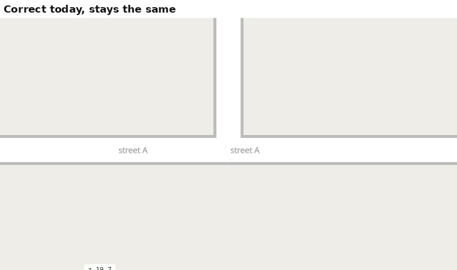

**In Monaco:** 55,407 pairs (87% of all). Nothing to change.

## B. A tunnel under a street

**Situation:** a ground road goes into a tunnel (two tunnel edges, joined at a node), passes under a
street, and comes out as a ground road. Cases covered: mouths (ground to tunnel), the joint inside
the tunnel (tunnel to tunnel), and the crossing (street over tunnel).

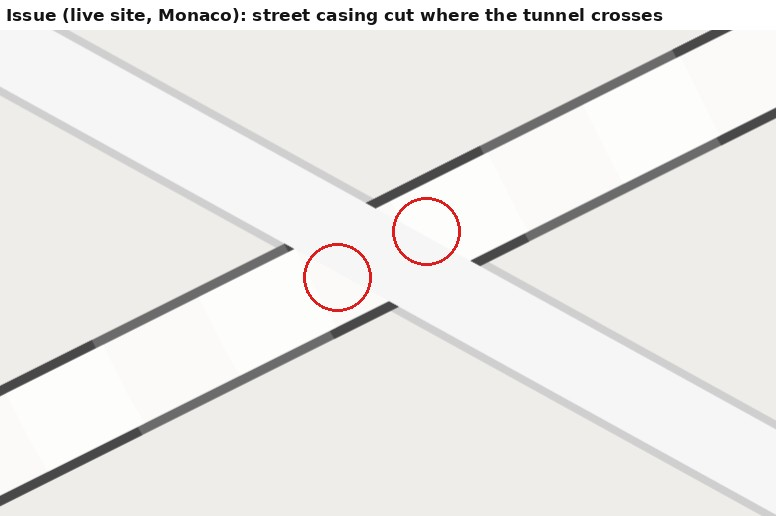

**Issue (before):** this is the **unreleased roadstyle branch** (the fix for the cut street casing). The
street is continuous over the tunnel, which is right, but the ground roads' round ends lie over the
tunnel at both mouths (notches), and a **white dot** shows at the joint of the two tunnel edges. On
the **live site** the same scene looks good: the tunnel is drawn in stretches that merge with the
road at the mouths. The cut pedestrian casing you reported (Monaco) is a live-site problem I could
**not** reproduce in a synthetic scene (I tried a wide pedestrian street crossing at an angle).

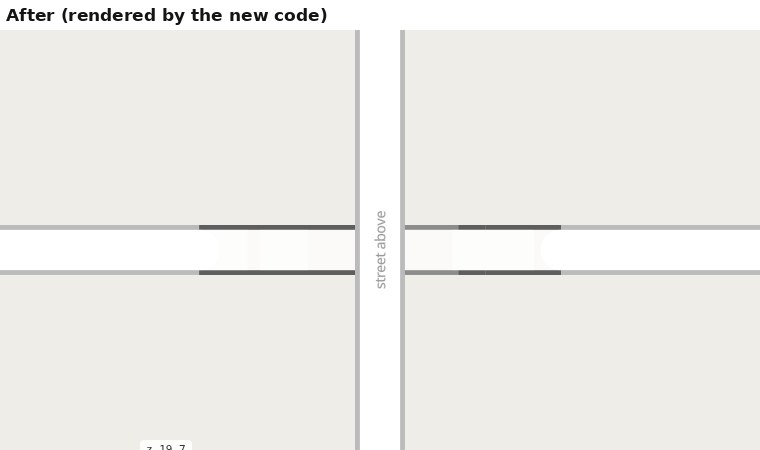

**After:** street over tunnel with its casing continuous (R2); the tunnel drawn at ground level
near each mouth, so the casing meets the road square, with no notch (R1, R4); the faded tunnel
look kept all along (R3); no dot at the joint (the pieces share a band).
**In Monaco:** mouths 1,972 pairs; tunnel to tunnel 1,557; tunnel under a ground road 1,299.

## C. A bridge over a street

**Situation:** a ground road goes up onto a bridge (two deck edges), over a street, and down again.

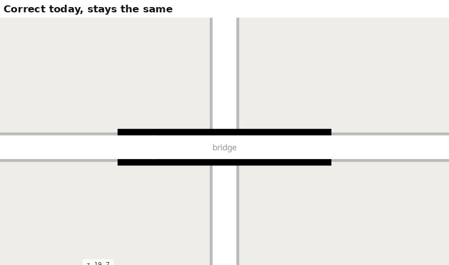

**In Monaco:** bridge over a ground road 156 pairs; ground to bridge joints 533. Nothing to change:
the deck's black casing has square ends and the street keeps its casing under it.

## D. A raised road over a street, joined to ground paths

**Situation:** your plaza edge. A path tagged `layer=1` (no bridge tag) starts at a node shared with
two ground paths and passes over a street 17 m further on.

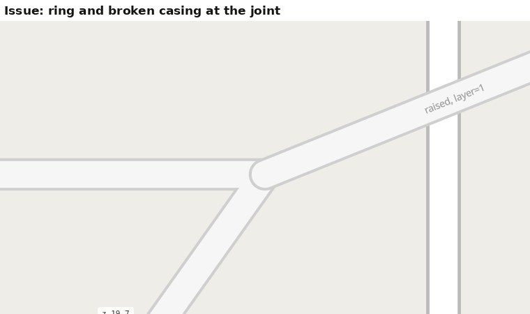

**Issue:** the whole edge is in the high band, so at the joint its round casing end is drawn over
the ground paths: a ring and a broken casing. Connected roads look unconnected. This reproduces
your picture of edge `2727263958372164090`.

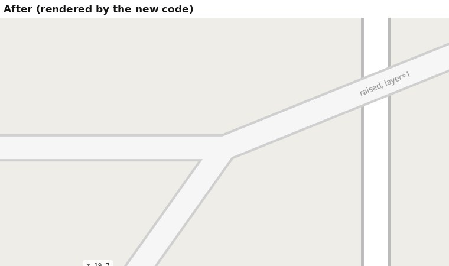

**After:** ground at the joint with the casings merged; raised only over the street, with square
ends where the raised piece starts (R4).
**In Monaco:** about 60 such plain-`layer` edges (62 with the first version of my rule, 307
counting tunnels and bridges).

## E. A raised walkway with a ground branch

**Situation:** two raised walkway edges (each passes over a street) meet at a node where a ground
path also joins.

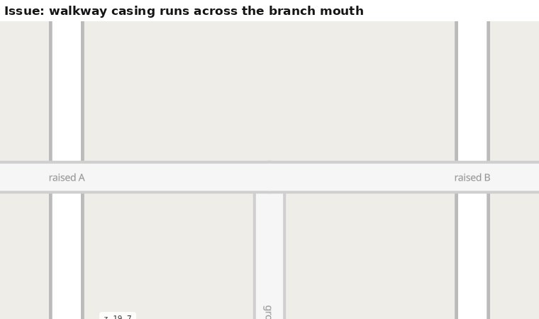

**Issue:** the walkway's casing line runs straight across the mouth of the ground branch, so the
branch looks cut off. Same on both roadstyle versions. (Your Avenue de Fontvieille picture shows a
bigger ring of this kind; I could not reproduce that exact ring yet.)

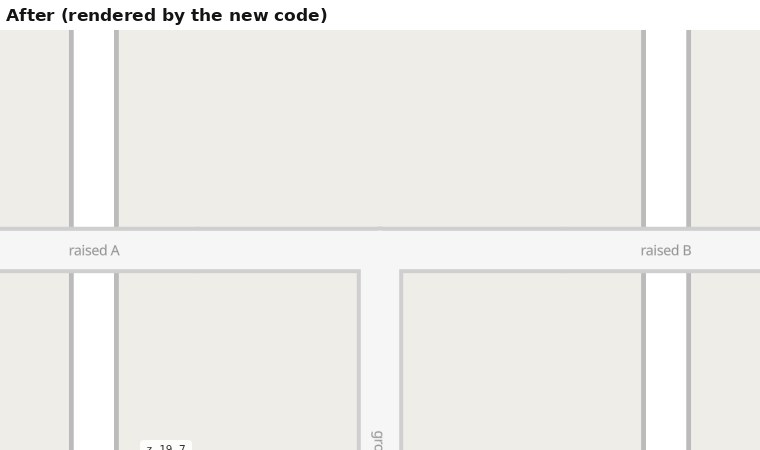

**After:** one clean junction with the casings merged. The walkway is at ground level at the node
(it passes over nothing there) and raised only over each street (R4).
**In Monaco:** ground to raised joints 960 up and 400 down; layer to layer at the same level 608.

## F. A crossing at the same level, with no shared node

**Situation:** a footway crosses a street at the same level with no node of its own on it (a zebra,
or a missing junction in the data).

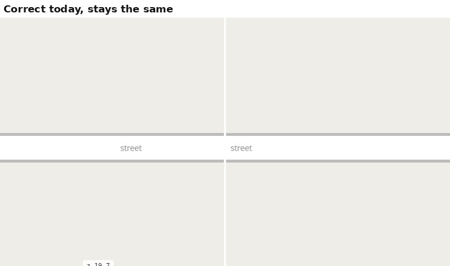

**In Monaco:** about 400 pairs. For a zebra the thin line over the casing is the intended look.
It is not a level problem; the edges are also not connected for routing, which duckOSM's
`split_here` fix (A1 in `junctions.md`) handles.

## G. Touching with no node

**Situation:** a path starts on the middle of another path with no node there.

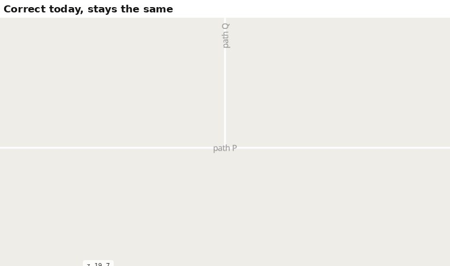

**In Monaco:** about 890 pairs. Thin lines, harmless to the eye. The wide cases (a pedestrian
square's outline drawn as a street, overlapping its roads) are fixed in the data (A2 and Rule 2 in
`junctions.md`), not in the drawing.

## Your reported places in Monaco, before and after

Real renders of the whole Monaco map, the live site above and the new code below, at the places you reported.

**The tunnel crossing** (pedestrian street over tunnel `1186510750682437559`): the street's casing is continuous; the
tunnel keeps today's look.
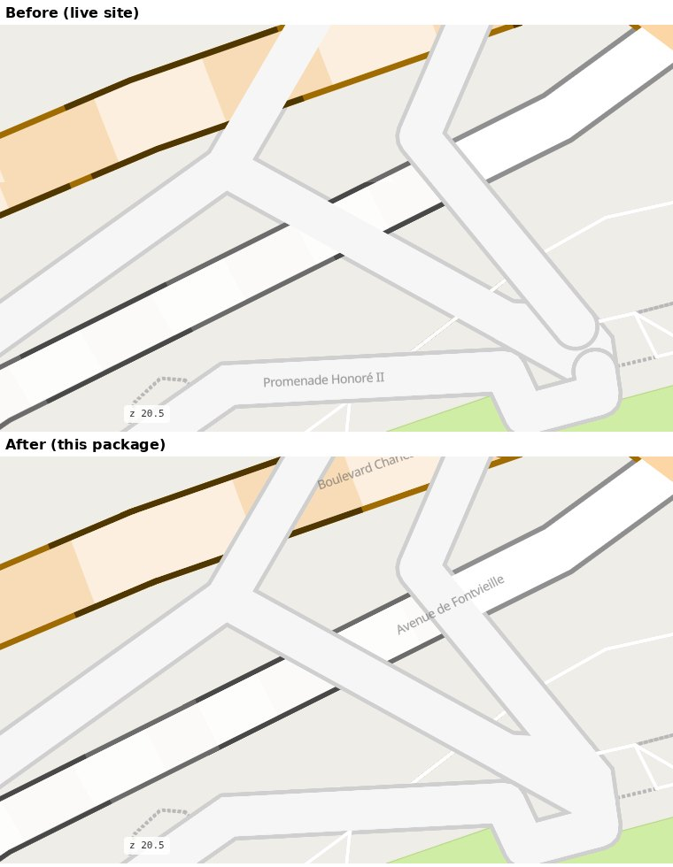

**The junction at `4070595946847136678`:** clean, casings merged.
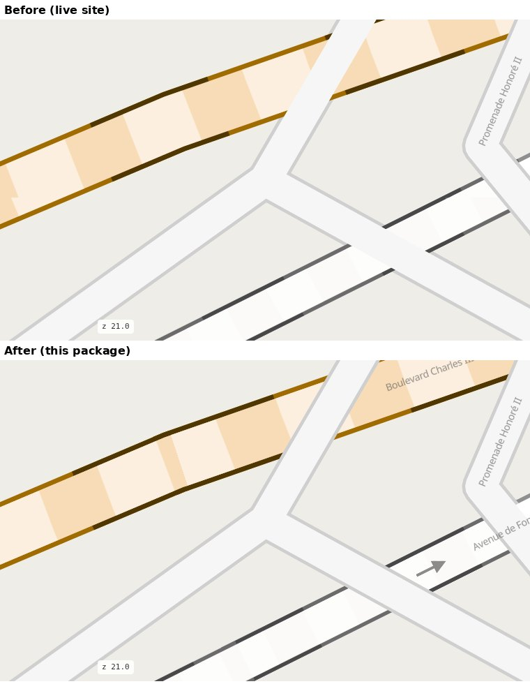

**The plaza ring at `2727263958372164090`:** gone. (This edge passes over tunnels only, so it is whole at
ground level.)
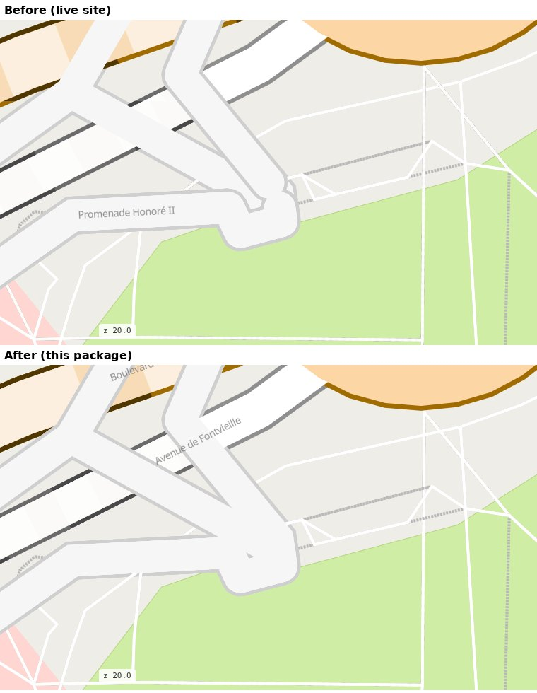

**Avenue de Fontvieille** (the raised walkway ending in a round end on the tunnel): the joint is clean.
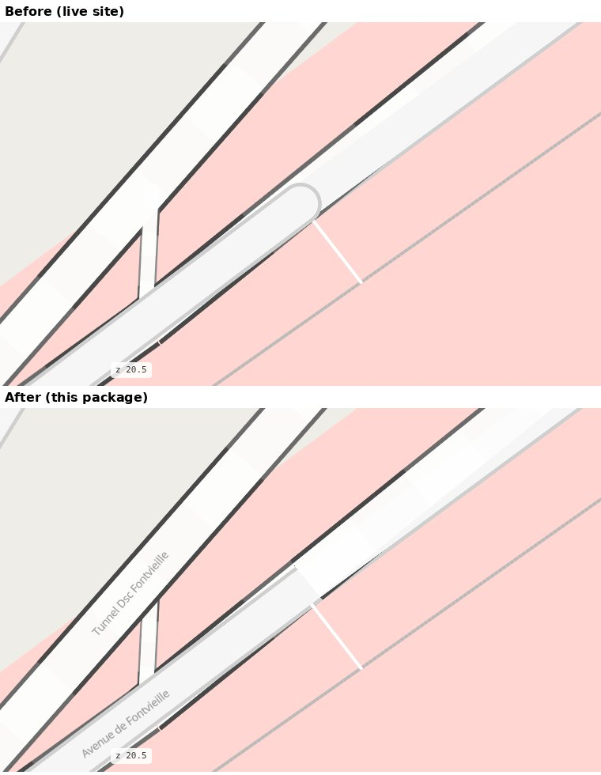

## What was built

- **mapstyle** (`src/mapstyle/levels.py`, `map.py`): `load_pieces` finds, with one spatial join, the roads that
  really cross a road at another level; `with_pieces` cuts each edge into pieces (ground, and the stretch over or
  under, 4 m plus the crossing road's half width clear, neighbours overlapping 0.3 m so no hairline shows). Extra
  pieces are appended rows (`_piece`); the first piece keeps the edge's row, so the planner's graphs are unchanged.
  The dashboard counts edges, not pieces. `render_map(pieces=False)` turns it off.
- **roadstyle** (branch `square-ends`): `cap_col` (square ends per edge, twin `-sq` layers), the tunnel look in
  any band, and an opaque underlay under a tunnel's translucent fill, so the tunnel keeps the look it has on the
  live site.
- **Tests:** mapstyle 47 pass (fresh Monaco build); roadstyle 250 pass. The 83-case gallery: 44 of 81 images
  unchanged, the rest differ only at tunnels and raised roads (compared by pixels; reviewed at four places).

## Colour and casing, in one table

| Road | Casing | Fill | Band |
|---|---|---|---|
| ordinary (any class) | class casing | class colour | ground, or by R2 |
| plain `layer` tag | class casing | class colour | ground except over a real crossing (R4) |
| tunnel | two-tone | faded | ground at the mouths, low under a road (R4) |
| bridge | black, heavier, square-ended deck | class colour | high (as today) |
| crossing / sidewalk | class casing | class colour | over / under the street (done) |

## Cost and risks

- **R4 is the old "stretches" idea,** which roadstyle removed on 2026-10-01 because every overlay
  (arrows, lane lines, labels) had to know about it. Doing it again in mapstyle brings that cost
  back, in mapstyle. Pieces are extra features for roadstyle's `band_col`: the dashboard counts
  (12,941 edges), the page's feature ids and a click on a piece selecting its whole edge all need
  care.
- **Releasing the branch has a visible cost** (case B): it fixes the cut pedestrian casing, but adds
  notches at tunnel mouths and a dot at tunnel joints, which the live site does not have.
- **Square ends are not available per feature** in roadstyle (MapLibre cannot set `line-cap` per
  feature).
- **R2's graph test** is one spatial join: 6.6 s on `stockholm_county` (measured).

## Order of work (done on the branches), and what is left

1. Done: roadstyle `cap_col`, tunnel look in any band, tunnel underlay (branch `square-ends`).
2. Done: mapstyle pieces for plain-`layer` roads and tunnels (branch `levels-pieces`).
3. Left, yours: review and merge `levels-and-looks` and `square-ends` in roadstyle, release it, raise mapstyle's
   `roadstyle` pin to that release (an older roadstyle ignores `cap_col`: round ends, rings return), merge
   `levels-pieces`, push (CI rebuilds the site). Nothing is pushed.

## Changes made after sign-off: waiting for Kaveh's permission

These were added **in code** (local branches `levels-pieces` and `square-ends`, nothing pushed) while fixing the pairs
you reported, **without** first updating this plan or asking. Each is a change of rule, so each needs your yes or no.
If you say no, I revert it.

| # | Change | Why I did it | Effect | Where |
|---|---|---|---|---|
| C1 | A road goes over / under another also when their **drawn widths overlap**, not only when the lines cross (R2 said: cross, no shared node) | Pair `4070595946847136678` / `7270978127836132176`: 2.4 m apart, never touching, but drawn merged as if connected | about 289 Monaco edges are cut (was fewer) | `levels.py` `_pieces_of`, SQL |
| C2 | Neighbouring pieces **overlap 0.3 m** | A hairline showed where two square ends only touched | invisible seam | `levels.py` `OVERLAP_M` |
| C3 | A **joint end keeps a ground piece of at least 4 m** where the crossing allows | Tunnel mouths: the underground stretch reached the node | longer ground piece at mouths | `levels.py` `END_M` |
| C4 | **Roads that meet a stretch at a node end square** (`cap_col` on those roads) | Pairs `2694529092516317559` / `5213788470366489481` and `7652029510735114293` / `5566772266206780522`: a crossing road about 6 m from a tunnel mouth left no ground piece, so the ground road's round end showed as a ring | those roads (both ends) are square; a sharp corner at their other end could show a small notch | `levels.py` `level_pieces`, `with_pieces` |
| C5 | An **opaque underlay** under a tunnel's translucent fill (roadstyle) | The unreleased `levels-and-looks` drew grey blocks; this keeps today's tunnel look | the tunnel looks as on the live site | roadstyle `render_web.py` |

Not rule changes: the dashboard's edge counts (pieces are not edges) and a hang fixed in `scripts/dashboard_check.py`.

## Decisions for Kaveh

1. **Square ends for the pieces** (needed, or R4 only moves the ring):
   (a) a small roadstyle addition, a per-edge `cap_col` like `band_col` (your call: "roadstyle is not
   changed" has an exception for what you ask for); or (b) mapstyle draws the raised pieces in its
   own layers from `layers.js`, with square ends, and leaves roadstyle alone.
   I recommend (a): smaller and one place for everyone.
2. **Where to cut:** in mapstyle (my pick, no new edge ids for sensor-matching) or in duckOSM.
3. **Clearance** between the cut and the crossing: 4 m (the old value), or another?
4. **The roadstyle branch:** release it only after R4 for tunnels (my pick), or now and accept the
   notches and dots for a while?
