# Approach B: a level for each node (no cutting)

**Status:** proposal and **prototype only**, for Kaveh's decision. Nothing in the library uses it. It is the second
approach next to the cutting of `levels_plan.md` (Approach A). Idea and wording: Kaveh, 2026-10-02 ("assign an interval
to each edge ... the begin of the interval is the time for drawing the casing of the edge and the end of the interval
is the time of filling the casing with the edge colour").

## The idea

Every edge gets two times, drawn in time order: `c` (its casing) and `f` (its fill), `c < f`. Its interval is `[c, f]`.

- **Two edges that share a node** must have intersecting intervals (`c_A < f_B` and `c_B < f_A`). Each casing is then
  under the other edge's fill: the two merge cleanly at the node.
- **Two edges that cross with no shared node**, one over the other, must have disjoint intervals, the upper later
  (`f_lower < c_upper`). The upper edge is then drawn completely over the lower one, with its own casing: an overpass.
- Two edges that never cross: anything.

### It comes down to one level for each node

All edges at a node must pairwise intersect, so they share one common time there. Give each **node** a level `p`.
An edge's casing time is the **lowest** level of its two nodes and its fill time the **highest**:
`c = min(p_start, p_end)`, `f = max(p_start, p_end)`. For an overpass (upper `U`, lower `L`, no shared node) the only
requirement is: **every node of `U` has a higher level than every node of `L`**.

An edge between two nodes of the same level `k` is an ordinary edge of level `k` (casing and fill in level `k`, as in a
band). An edge between a level-0 and a level-1 node (a ramp) has its **casing with the level-0 casings and its fill with
the level-1 fills**. So its casing is under the ground roads' fills (it merges with them at the ground end) and its
fill is over them (it merges with the raised edges at the other end). Roadstyle's "band" is the special case where
casing and fill are in the same level.

### The heuristic (not necessarily correct)

1. **Pairs.** Every pair of edges whose lines cross, with no shared node and a different level tag
   (`layer`, bridge, tunnel; roadstyle's level rule): `(upper, lower)`.
2. **Cycles.** Build "this node must be above that node" for every pair (every node of the lower edge to every node
   of the upper edge). Drop the pairs whose nodes lie in one cycle (strongly connected component): no levels can
   satisfy them (a spiral ramp, an interleaved structure). What remains is acyclic.
3. **Levels.** Rank the nodes by the longest chain of "must be above" below them.
4. **Place.** For each connected part, shift all ranks by one number so that most nodes are near the level their
   edges' tags suggest (a node on a ground road: 0, else the level nearest 0 among its edges). Nodes in no pair stay 0.
5. **Draw.** One casing layer and one fill layer for each level, in level order. An edge's casing is in the layer of
   its lowest node level, its fill in the layer of its highest.

The step between levels falls on the **neighbouring edge** that joins the two levels (for a raised edge crossing a
street and joined to a ground path, the path is the ramp), not on the long edge, which stays whole.

## Test (prototype: `scripts/node_levels.py`, `scripts/node_levels_render.py`)

**The algorithm on Monaco** (12,941 edges, 4,539 nodes):

| | |
|---|---|
| crossing pairs with different levels | 1,882 |
| dropped as unsatisfiable (cycles) | 16 (0.9%) |
| pairs still violated after solving | 0 |
| node levels used | -2 … 2 (5 levels) |
| edges whose casing and fill are in the same level | 11,893 (91.9%) |
| edges that span 1 / 2 / 3 levels | 919 / 117 / 12 (8.1% together) |

(Approach A cuts about 289 edges; Approach B makes 1,048 edges span levels, but none is cut and no feature is added.)

**Drawn on synthetic scenes** (a prototype page: roadstyle's layers hidden, one casing and one fill layer for each level
added in the browser; the tunnel and bridge looks are not redone, so the tunnel is plain):

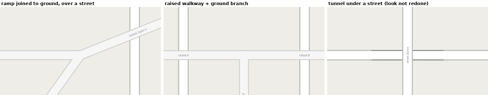

The ramp and the raised walkway join their ground paths without a ring and pass over the street with their own
casing. The street is continuous over the tunnel.

**Drawn at the places you reported** (left: the live site; right: Approach B; tunnels are plain in the prototype):

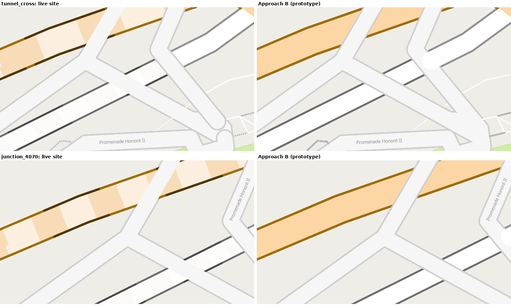
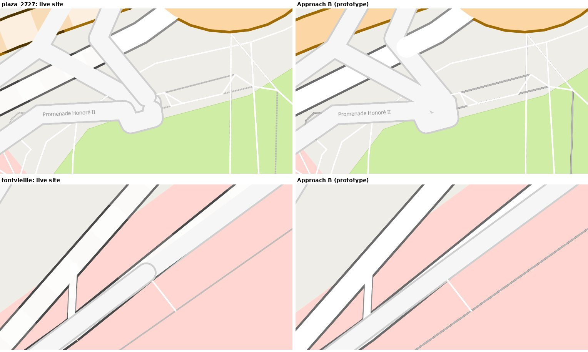
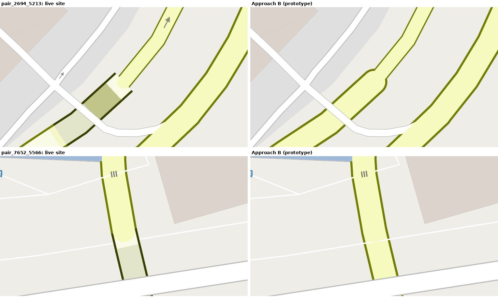
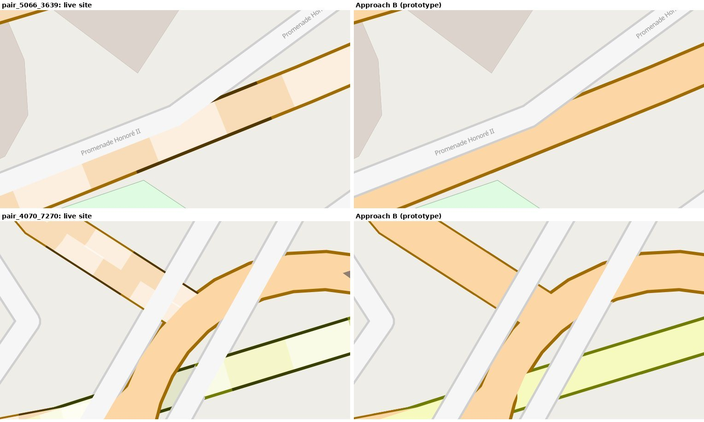

What I see:

| Place | Approach B |
|---|---|
| tunnel crossing (`1186510750682437559`) | pedestrian street's casing continuous; the plaza ring is gone |
| junction `4070595946847136678` | clean |
| plaza edge `2727263958372164090` | ring gone |
| Avenue de Fontvieille | clean, no ring |
| `2694529092516317559` / `5213788470366489481` | the slip road joins the tunnel as one road: **correctly connected** |
| `7652029510735114293` / `5566772266206780522` | joined, no ring: **correctly connected** |
| `5066803562804960394` / `3639438131486059958` | **wrong**: the tunnel is drawn over the pedestrian band that should pass over it |
| `4070595946847136678` / `7270978127836132176` | bands over the road, each with its own casing |
| (two places) | a **white round blob** where a tunnel's round end shows over a pedestrian band's casing |

## Optimization version (solved with a solver)

Kaveh, 2026-10-02: "make it as an optimization problem and solve it by a solver ... and use your approach for
initialization". Prototype: `scripts/node_levels_opt.py`, solver OR-Tools CP-SAT (installed outside the repository for
the test; not a dependency of mapstyle).

### The variables in plain words

Think of **floors**. Every node (a point where edges meet) gets a floor number: 0 is the ground, 1 is above it, −1 is
below it.

| Name | In plain words |
|---|---|
| `p_n` | the floor number of node `n`: what the solver finds |
| `v_q` | one yes/no for each overpass: "did we give up on it?" (0 is good, 1 is bad) |
| `w_q`, `o_q` | the same for a crossing at the same level: "given up?" and "which edge is on top?" |
| `d_e` | how many floors edge `e` climbs between its two ends (0: both ends on the same floor) |
| `r_n` | how far node `n` is from the floor its tags suggest |

**The rule.** If road U must pass over road L (they cross and share no node), then every node of U must be on a higher
floor than every node of L; otherwise `v_q = 1`, which costs a lot.

**What the solver wants:** (1) as few overpasses given up as possible; (2) edges flat, few floors climbed, above all on
long edges; (3) nodes on the floor their tags suggest.

**Example.** A raised path R is joined to a ground path P at node `a`, and R crosses a street G. The street's nodes are
on floor 0, so R's nodes, `a` included, must be on floor 1. P runs from `a` (floor 1) to its far node (floor 0), so
**P is the edge that climbs one floor**; R and G stay flat. Drawn: P's casing goes with floor 0 and its fill with
floor 1, so P merges with the ground roads at its far end and with R at `a`.

### The formula, exactly as given to the solver

**Sets and data**

- N: the nodes. E: the edges; edge e has end nodes s_e and t_e, and V(e) = {s_e, t_e}.
- ℓ_e ∈ ℤ: the level tag of e (the `layer` if nonzero, else 1 for a bridge, else −1 for a tunnel, else 0).
- len_e: the length of e in metres, and c_e = max(1, round(len_e / 5)): the cost of one level step on e.
- P ⊂ E × E: the **overpass pairs** (U, L): ℓ_U > ℓ_L, no node in common, and the lines cross. (The "candidate" runs
  also include the pairs whose drawn widths overlap.)
- S ⊂ E × E: the **same-level crossings** {a, b}: ℓ_a = ℓ_b, no node in common, the lines cross. (Later runs only.)
- pref_n: for each node n, the tag ℓ_e (over the edges e at n) with the smallest |ℓ_e|, clamped to [−K, K].
- Constants: K = 4, W1 = 1000, W1S = 300, W2 = 10, W3 = 1.

**Variables**

```
p_n   ∈ {−K, …, K}        for every node n ∈ N          (the level of the node)
v_q   ∈ {0, 1}            for every pair q ∈ P          (1 = the overpass is given up)
w_q   ∈ {0, 1}            for every pair q ∈ S          (1 = the crossing is given up)
o_q   ∈ {0, 1}            for every pair q = {a, b} ∈ S (1 = a is on top of b)
d_e   = | p_(s_e) − p_(t_e) |   ∈ {0, …, 2K}   for every edge e   (the level step on e)
r_n   = | p_n − pref_n |        ∈ {0, …, 2K}   for every node n   (the distance from the tags)
```

**Constraints**

```
(1)  for every q = (U, L) ∈ P, every u ∈ V(U), every l ∈ V(L):
         v_q = 0   ⇒   p_u − p_l ≥ 1

(2)  for every q = {a, b} ∈ S, every x ∈ V(a), every y ∈ V(b):
         ( w_q = 0 ∧ o_q = 1 )   ⇒   p_x − p_y ≥ 1
         ( w_q = 0 ∧ o_q = 0 )   ⇒   p_y − p_x ≥ 1
```

(d_e and r_n are tied to the p's by the solver's absolute-value constraint.)

**Objective**

```
minimize   W1 · Σ_{q∈P} v_q   +   W1S · Σ_{q∈S} w_q   +   W2 · Σ_{e∈E} c_e · d_e   +   W3 · Σ_{n∈N} r_n
```

Read from left to right: as few overpasses given up as possible; as few same-level crossings given up; as few level
steps as possible, on short edges; and as close to the tags as possible.

**Start (warm start).** The heuristic's solution is given as a hint: p_n = its level; v_q = 1 for the pairs the
heuristic dropped, 0 for the others; for S, w_q = 0 and o_q the order its levels already give, if they are disjoint,
else w_q = 1.

**Reading the answer.** For each edge: casing level κ_e = min(p_(s_e), p_(t_e)), fill level φ_e = max(p_(s_e), p_(t_e)).
Two edges that share a node both contain that node's level in [κ, φ], so their intervals intersect (they merge); for a
pair in P that is satisfied, φ_L < κ_U, so the intervals are disjoint and U is drawn over L.

**Solver settings.** OR-Tools CP-SAT, 8 workers, a time limit of 60 to 150 s. It does not prove optimality in that time.

### The same problem written with an interval for each edge

Kaveh's first formulation has an interval [c_e, f_e] for each edge (c_e: the time of the casing, f_e: the time of the
fill, c_e ≤ f_e). The solver was given the form with a level for each **node** instead, because the two are the same
problem:

- All edges at a node must pairwise intersect. Intervals have this property: a family of intervals that pairwise
  intersect has a **common point**. That point is the node's level p_n, so p_n lies inside the interval of every edge
  at the node.
- The smallest intervals that contain the levels of their two nodes are c_e = min(p_(s_e), p_(t_e)) and
  f_e = max(p_(s_e), p_(t_e)). A smaller interval never breaks an intersection at a node and never creates an
  intersection with a road it must be disjoint from, so nothing is lost by taking the smallest.

With the interval variables written out, the model is:

```
variables     p_n, c_e, f_e (integers),  v_q ∈ {0,1}
constraints   c_e ≤ p_(s_e) ≤ f_e   and   c_e ≤ p_(t_e) ≤ f_e          for every edge e
              v_q = 0  ⇒  f_L + 1 ≤ c_U                                  for every overpass q = (U, L)
objective     minimize  W1 · Σ_q v_q  +  W2 · Σ_e cost_e · (f_e − c_e)  +  W3 · Σ_n |p_n − pref_n|
```

Its answer is the same as the node form's, because f_e − c_e = d_e at the best choice. An interval variable that is
free (larger than the span of the node levels) would only be useful to push two edges apart on purpose.

### What pairs the solver was given, and what it was not

Kaveh, 2026-10-02: "so you didn't give the solver the list of crossing pairs?" and "if you add more than the exact
crossing pairs it is OK too: a list of *possible* crossings is good; it is better than considering all pairs."
In Monaco there are:

| Kind of pair | Count | In the first runs | Later runs |
|---|---|---|---|
| lines cross, no shared node, **different** level tags (overpass) | 1,882 | yes | yes |
| lines cross, no shared node, **same** level tag (a zebra, a missing junction) | 344 | **no** | yes: `S_q`, either edge may be on top |
| no crossing, no shared node, different tags, drawn widths overlap (the 1.3 m case) | 3,785 (76 touch or overlap exactly) | **no** | yes, as overpass pairs ("possible crossings") |
| share a node **and** cross somewhere else | 105 | no | **no**: the model cannot say it (see below) |

**Same-level crossings (`S_q`).** Each gets a boolean `o_q` ("a is on top") and a give-up variable `w_q`:
`w_q = 0 and o_q  implies  p_a - p_b >= 1` for every node pair, `w_q = 0 and not o_q  implies  p_b - p_a >= 1`; cost
`W1S * w_q` with `W1S = 300` (less than an overpass: these are often data errors).

**Why 105 pairs cannot be given.** Two edges that share a node must have intersecting intervals (that is how they
merge), and two edges that cross in their middle must have disjoint intervals. Both cannot hold. In the model a
node-sharing pair is simply "connected". Such an edge needs the cutting of Approach A.

### Result on Monaco, crossing pairs only

| | heuristic | solver, crossing pairs | solver, crossing + "drawn widths overlap" pairs |
|---|---|---|---|
| pairs | 1,882 | 1,882 | 5,667 |
| pairs given up | 16 dropped | **9** | 334 (5.9%); the heuristic's start dropped 1,125 |
| edges that span 1 or more levels | 1,048 | **766** (60 s: objective 26,761, bound 23,565; 90 s: 25,059, bound 23,560) | 1,315 |
| node levels used | -2 .. 2 | -3 .. 2 | -4 .. 4 |

The solver is better than the heuristic on both counts, but it is not proven optimal (the gap to its bound is 6 to 12%).
Adding the "drawn widths overlap" pairs (the C1 rule of `levels_plan.md`) makes the problem much harder: three times
the pairs and many conflicts. As a node-level problem it does not look usable as it stands.

### Result with the pairs added

| | heuristic | solver, overpass crossings | solver, + same-level crossings | solver, + same-level + possible crossings (all candidates) |
|---|---|---|---|---|
| overpass pairs | 1,882 | 1,882 | 1,882 | 5,667 |
| same-level pairs | not used | not used | 344 | 344 |
| overpass pairs given up | 16 (dropped) | 9 | 9 | 338 to 341 (6%) |
| same-level pairs given up | | | 0 | 4 to 12 |
| edges that span 1 or more levels | 1,048 | 766 | 1,209 | 1,729 (13.4%) |
| node levels used | -2 .. 2 | -3 .. 2 | -3 .. 2 | -4 .. 4 |
| solver, time and result | none | 60 s, objective 26,761, bound 23,565 | 100 s, objective 32,846, bound 23,560 | 120 s, objective 393,404, bound 359,988 |

Adding the same-level crossings costs about 440 more edges that span a level and gives up no pair. Adding the
possible crossings multiplies the pairs by three, the solver gives up 6% of the overpasses, and a seventh of the edges
span levels.

### Drawn at your places: live site, solver with crossing pairs, solver with all candidate pairs

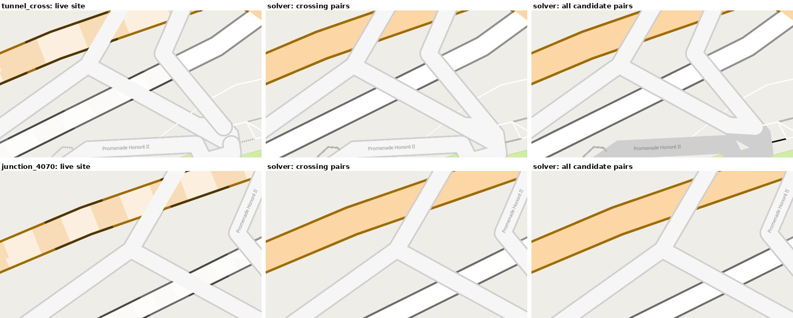
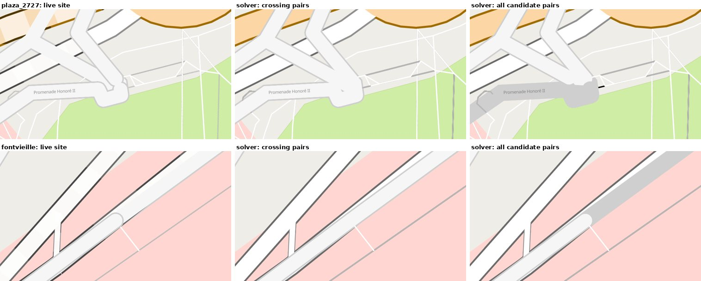
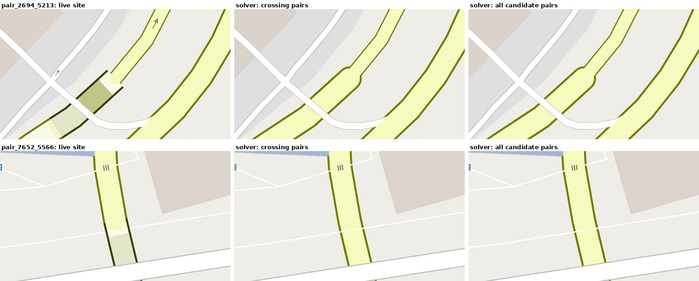
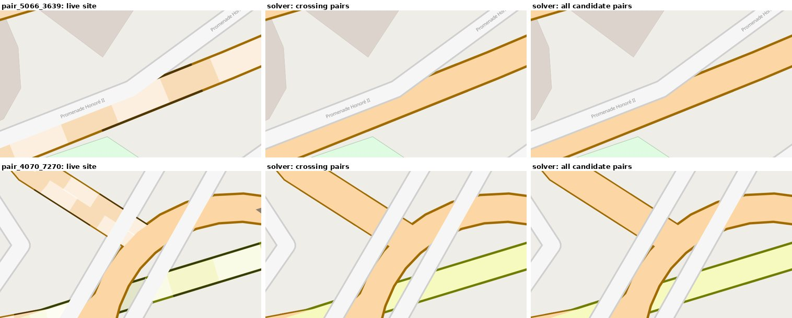

- **The extra pairs did not fix `5066803562804960394` / `3639438131486059958`.** Even though the pair is now a
  constraint, the pedestrian band is still drawn under the tunnel: the solver gave that pair up (it is among the 338
  to 341).
- **They made another place worse.** At the tunnel crossing, with all candidate pairs, a pedestrian band
  (Promenade Honoré II) is drawn as a grey area: its casing is in a higher level than its fill is drawn, because that
  edge now spans three levels.
- **So the best result so far is the solver with the overpass crossings only**, which is clean at seven of the eight
  places, and the same wrong place.

### Where the solver failed (the 9 pairs it gave up, crossing pairs only)

The run with the overpass crossings only (60 s, objective 26,314, bound 23,564) gave up 9 pairs. They are in four places:

| Place | Pairs | Edges (upper over lower) | What is drawn |
|---|---|---|---|
| near 7.41949, 43.73827 (a station) | 4 | footways `1300603807190493280`, `1046203032802764183` (level 0) over steps tunnels `4988690792929201909`, `8825042572998479971` (−2) | nothing wrong is visible |
| near 7.41193, 43.73136 | 1 | service tunnel `7513686230192698053` (−2) over primary tunnel `1943370964926618174` (−4) | looks right |
| near 7.41786, 43.73362 | 2 | pedestrian `5421095854252657624`, `5819311505590269978` (0) over primary tunnels `5832769262716690314`, `8691687783733863412` (−2) | **wrong**: the tunnels are drawn over the pedestrian band |
| near 7.41784, 43.73373 | 2 | the same pedestrian edges over the same tunnels | **wrong**, as above |

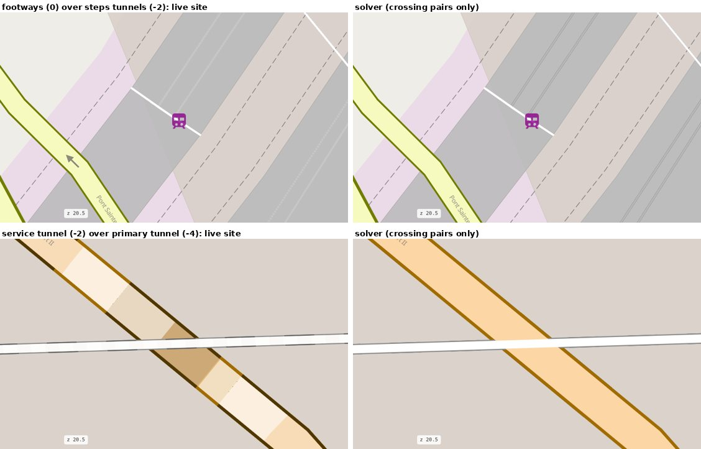
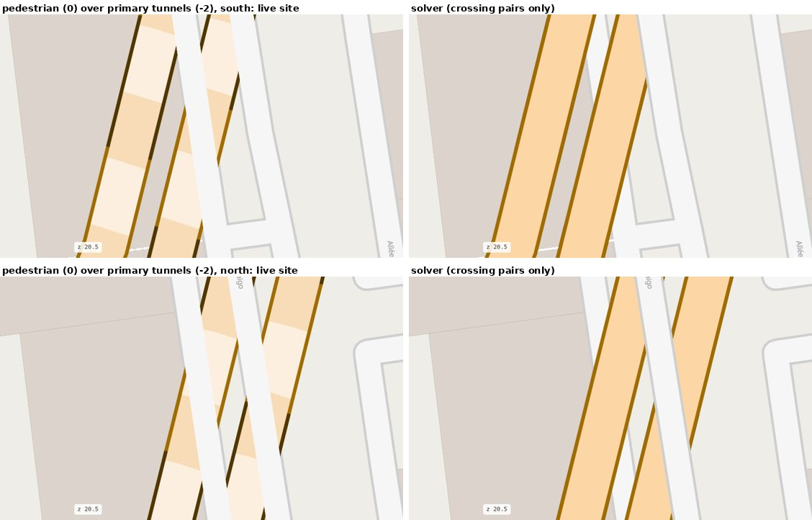

Eight of the nine are also the pairs the heuristic dropped as a cycle. I have **not** traced which cycle (which chain of
overpasses and shared nodes) forces them. Two of the four places show no error on the map; the pedestrian bands over the
tunnels are the real failures. Besides the pair `5066803562804960394` / `3639438131486059958`, which got no constraint,
these are the places where this model gives a wrong picture.

### Drawn at your places: live site, heuristic, solver (overpass crossing pairs only)

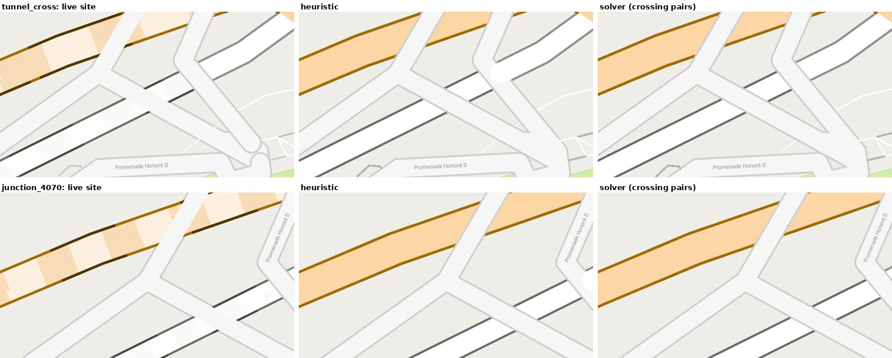
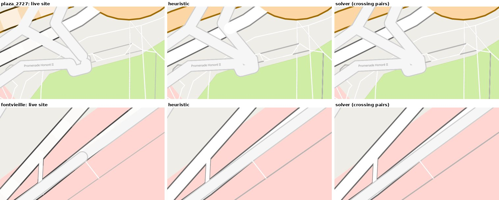
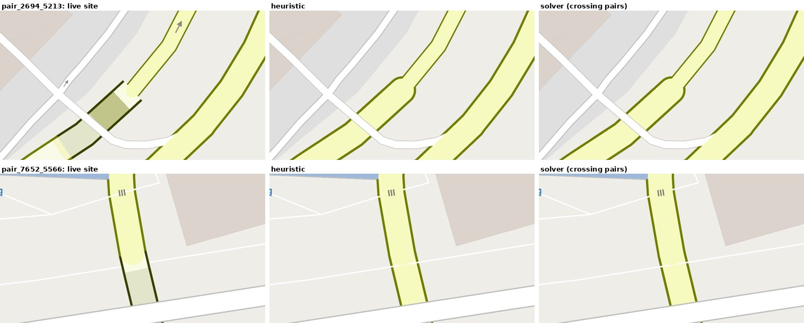
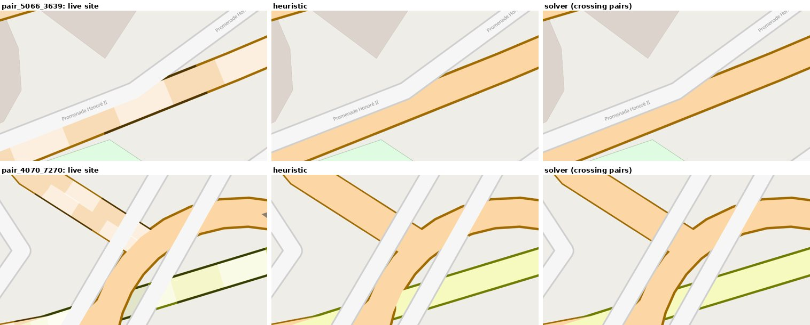

- The solver **removes the white round end** the heuristic left at the tunnel crossing and at the plaza edge.
- Clean at the tunnel crossing, `4070595946847136678`, the plaza edge, Avenue de Fontvieille.
- The slip road and the tunnel join as one connected road in both pairs (`2694…`/`5213…`, `7652…`/`5566…`); where
  their widths differ there is a small shoulder in the casing.
- **Still wrong:** `5066803562804960394` / `3639438131486059958`. The pair does not cross (the lines are 1.3 m apart), so
  neither the heuristic nor the solver has a constraint for it. Only the "drawn widths overlap" version would, and that
  version is the hard one above.

## What it needs

- **Roadstyle:** an edge's casing and fill in different levels (two new columns, a small extension of `band_col`), and
  more than three levels (here 5; layers `roads-casing-<level>` and `roads-fill-<level>`). Tunnel and bridge looks
  (dashes, deck) would have to follow the levels.
- **mapstyle:** the node levels (a spatial join for the pairs, a graph step: about 100 lines).

## Weaknesses found

1. **Only crossings are constrained.** A tunnel that runs next to a band without the lines crossing (1.3 m apart,
   `5066…` / `3639…`) is "free", so it can be drawn over the band. Adding the pairs whose drawn widths overlap (the
   C1 rule of `levels_plan.md`, a rule change that needs your permission in either approach) was tested: it did not
   fix that pair and made another place worse.
   Also, 105 pairs share a node and cross elsewhere: the model cannot express them.
2. **Cycles** (16 pairs for the heuristic, 9 for the solver) cannot be solved by levels. They need a fallback (the
   cutting of Approach A for those few edges).
3. **A blob** (round end of an edge shown over another edge's casing) at two places with the heuristic; the solver's
   levels do not show it at the places I looked at.
4. **Many edges span levels** (8.1%) and so their fills are drawn above all fills of the lower levels between their
   nodes; for an edge that touches other roads without a shared node that can show.
5. **The tunnel and bridge looks** are not done in the prototype.

## Decision for Kaveh

- **A (cutting)**: built on local branches; edges are cut; needs changes C1–C5 approved (`levels_plan.md`).
- **B (node levels)**: no cutting, a small graph step, a roadstyle extension; the weaknesses above are open.
- **A + B**: B for most edges, A's cutting only for the cycles and the places B cannot fix.

Nothing in this document is built into the library. The prototype scripts are in `scripts/` and are not imported
anywhere.
