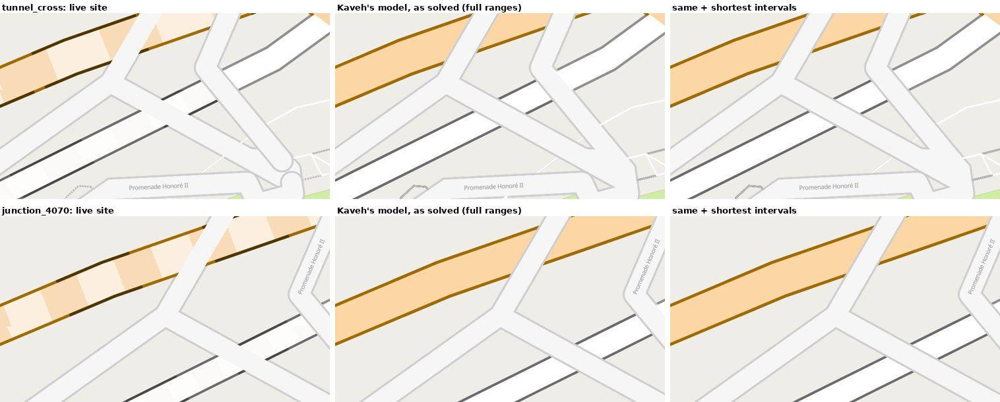
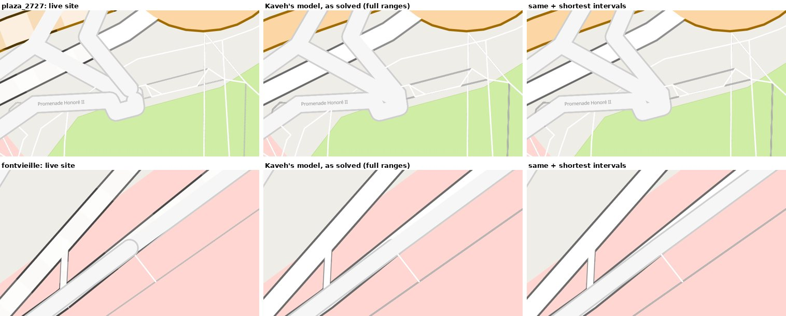
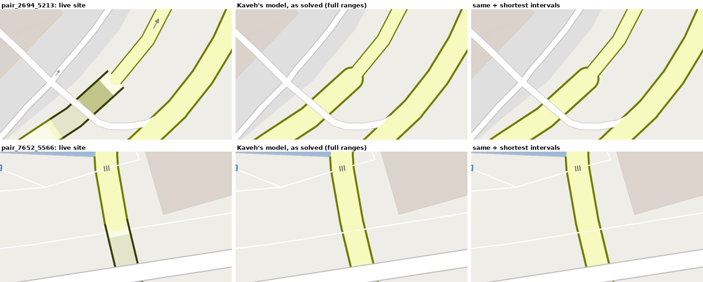
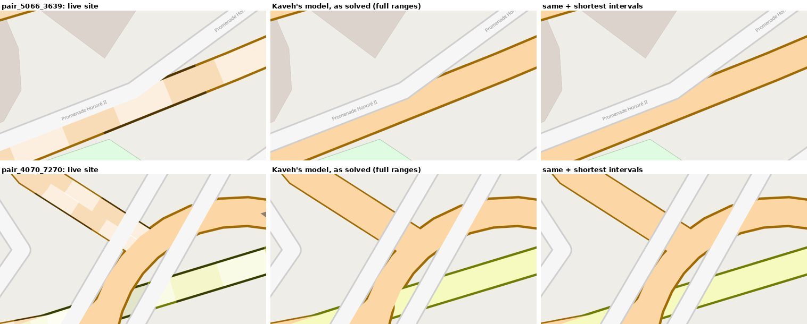
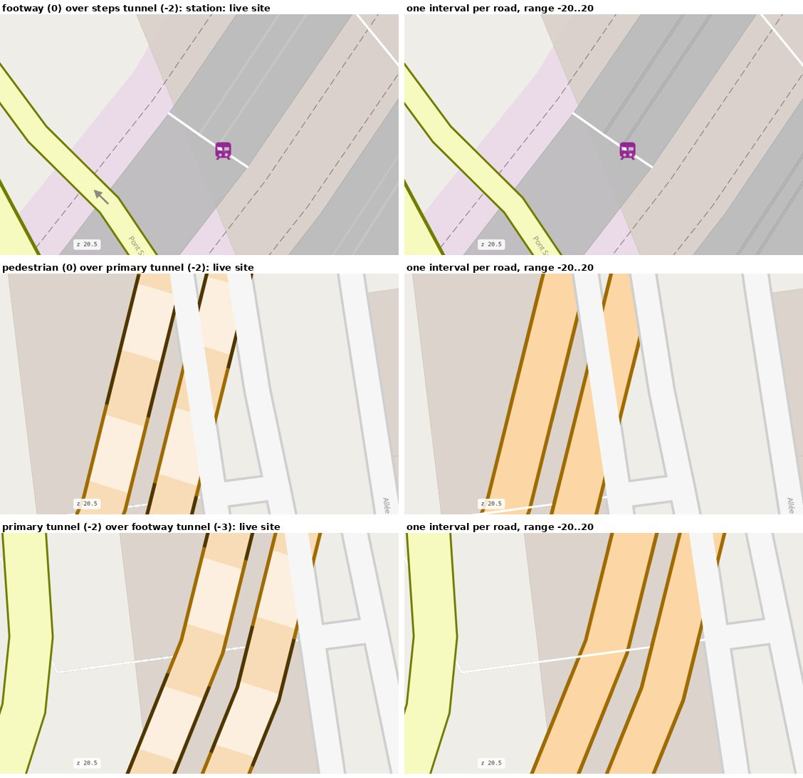
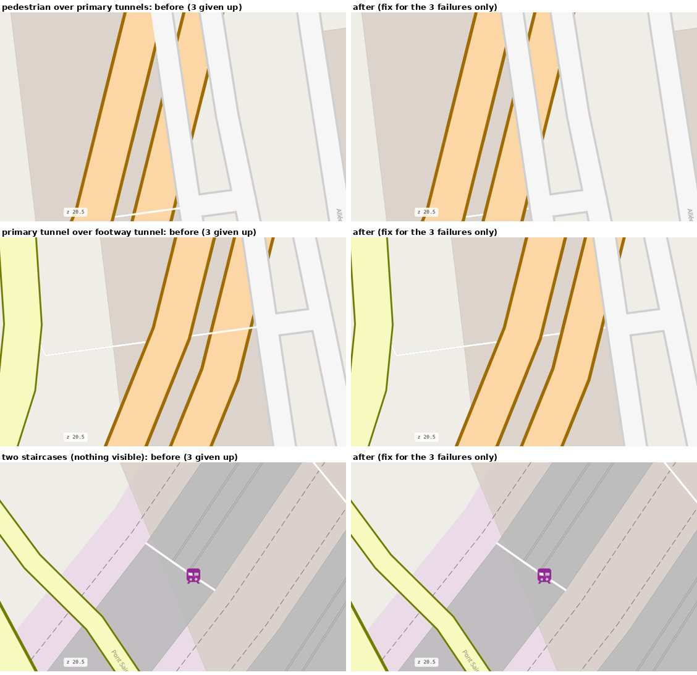

# Approach B: a level for each node (no cutting)

**Status:** proposal and **prototype only**, for Kaveh's decision. Nothing in the library uses it. It is the second
approach next to the cutting of `levels_plan.md` (Approach A). Idea and wording: Kaveh, 2026-10-02 ("assign an interval
to each edge ... the begin of the interval is the time for drawing the casing of the edge and the end of the interval
is the time of filling the casing with the edge colour").

## The idea

Every edge gets two times, drawn in time order: `c` (its casing) and `f` (its fill), `c < f`. Its interval is `[c, f]`.

- **Two edges that share a node** must have intersecting intervals (`c_A < f_B` and `c_B < f_A`). Each casing is then
  under the other edge's fill: the two merge cleanly at the node.
- **Two edges that cross with no shared node**, one over the other, must have disjoint intervals, the upper later
  (`f_lower < c_upper`). The upper edge is then drawn completely over the lower one, with its own casing: an overpass.
- Two edges that never cross: anything.

### It comes down to one level for each node

All edges at a node must pairwise intersect, so they share one common time there. Give each **node** a level `p`.
An edge's casing time is the **lowest** level of its two nodes and its fill time the **highest**:
`c = min(p_start, p_end)`, `f = max(p_start, p_end)`. For an overpass (upper `U`, lower `L`, no shared node) the only
requirement is: **every node of `U` has a higher level than every node of `L`**.

An edge between two nodes of the same level `k` is an ordinary edge of level `k` (casing and fill in level `k`, as in a
band). An edge between a level-0 and a level-1 node (a ramp) has its **casing with the level-0 casings and its fill with
the level-1 fills**. So its casing is under the ground roads' fills (it merges with them at the ground end) and its
fill is over them (it merges with the raised edges at the other end). Roadstyle's "band" is the special case where
casing and fill are in the same level.

### The heuristic (not necessarily correct)

1. **Pairs.** Every pair of edges whose lines cross, with no shared node and a different level tag
   (`layer`, bridge, tunnel; roadstyle's level rule): `(upper, lower)`.
2. **Cycles.** Build "this node must be above that node" for every pair (every node of the lower edge to every node
   of the upper edge). Drop the pairs whose nodes lie in one cycle (strongly connected component): no levels can
   satisfy them (a spiral ramp, an interleaved structure). What remains is acyclic.
3. **Levels.** Rank the nodes by the longest chain of "must be above" below them.
4. **Place.** For each connected part, shift all ranks by one number so that most nodes are near the level their
   edges' tags suggest (a node on a ground road: 0, else the level nearest 0 among its edges). Nodes in no pair stay 0.
5. **Draw.** One casing layer and one fill layer for each level, in level order. An edge's casing is in the layer of
   its lowest node level, its fill in the layer of its highest.

The step between levels falls on the **neighbouring edge** that joins the two levels (for a raised edge crossing a
street and joined to a ground path, the path is the ramp), not on the long edge, which stays whole.

## Test (prototype: `scripts/node_levels.py`, `scripts/node_levels_render.py`)

**The algorithm on Monaco** (12,941 edges, 4,539 nodes):

| | |
|---|---|
| crossing pairs with different levels | 1,882 |
| dropped as unsatisfiable (cycles) | 16 (0.9%) |
| pairs still violated after solving | 0 |
| node levels used | -2 … 2 (5 levels) |
| edges whose casing and fill are in the same level | 11,893 (91.9%) |
| edges that span 1 / 2 / 3 levels | 919 / 117 / 12 (8.1% together) |

(Approach A cuts about 289 edges; Approach B makes 1,048 edges span levels, but none is cut and no feature is added.)

**Drawn on synthetic scenes** (a prototype page: roadstyle's layers hidden, one casing and one fill layer for each level
added in the browser; the tunnel and bridge looks are not redone, so the tunnel is plain):


The ramp and the raised walkway join their ground paths without a ring and pass over the street with their own
casing. The street is continuous over the tunnel.

**Drawn at the places you reported** (left: the live site; right: Approach B; tunnels are plain in the prototype):


What I see:

| Place | Approach B |
|---|---|
| tunnel crossing (`1186510750682437559`) | pedestrian street's casing continuous; the plaza ring is gone |
| junction `4070595946847136678` | clean |
| plaza edge `2727263958372164090` | ring gone |
| Avenue de Fontvieille | clean, no ring |
| `2694529092516317559` / `5213788470366489481` | the slip road joins the tunnel as one road: **correctly connected** |
| `7652029510735114293` / `5566772266206780522` | joined, no ring: **correctly connected** |
| `5066803562804960394` / `3639438131486059958` | **wrong**: the tunnel is drawn over the pedestrian band that should pass over it |
| `4070595946847136678` / `7270978127836132176` | bands over the road, each with its own casing |
| (two places) | a **white round blob** where a tunnel's round end shows over a pedestrian band's casing |

## Optimization version (solved with a solver)

Kaveh, 2026-10-02: "make it as an optimization problem and solve it by a solver ... and use your approach for
initialization". Prototype: `scripts/node_levels_opt.py`, solver OR-Tools CP-SAT (installed outside the repository for
the test; not a dependency of mapstyle).

### Kaveh's model (the one to use): free intervals, intersection for shared nodes, penalty only on overpasses

Kaveh, 2026-10-02: "we didn't assign intervals only between −4 and +4 ... the node levels were your idea, and I told you
to use them as the initialization, not to bound the problem by them", then "instead of [0, 60] make it [−10, 10]", and
"**the only constraints are the range of the intervals and that the intervals intersect for all edges that share a node;
the penalty is only on overpasses**." This is that model, with nothing else (`solve_pure` in
`scripts/node_levels_opt.py`).

**Variables**

```
a_e, b_e  ∈ {−10, …, 10},  a_e ≤ b_e     for every edge e    (a_e: the time of the casing, b_e: the time of the fill;
                                                                the casing is at 2·a_e and the fill at 2·b_e + 1)
v_q       ∈ {0, 1}                        for every overpass pair q = (U over L)   (1 = this pair is given up)
```

**Constraints**

```
(1) every two edges x, y that share a node (hard):     a_x ≤ b_y   and   a_y ≤ b_x          [62,626 pairs in Monaco]
(2) every overpass pair q = (U over L), unless given up: v_q = 0  ⇒  b_L + 1 ≤ a_U           [1,882 pairs in Monaco]
```

An overpass pair is two edges whose lines cross, with no shared node and different level tags; U is the one with the higher tag.
Every other pair is free. **Same-level crossings (two crossing edges with the same tag) are not in the model**: Kaveh, 2026-10-02:
"I told you only overpass pair". I had added them on my own, with "either edge may be first"; I removed them again and re-ran:
the results are the same (8, 3, and the same 3 conflicts), see below.

**Objective:** minimize  `Σ_q v_q`  (the number of overpasses given up).

**Start (a hint only, not a bound):** a_e = min(p_s, p_t), b_e = max(p_s, p_t) from the heuristic's node levels; v_q = 1 for the
pairs the heuristic dropped.

**Result on Monaco** (OR-Tools CP-SAT, 8 workers; the intervals are the numbers a_e, b_e):

| | result |
|---|---|
| overpass pairs given up | **8, proved the minimum** (status OPTIMAL, 0.7 s). The heuristic gave up 16, my node form 9. |
| the intervals it returns | **11,855 of the 12,941 edges have the whole range** [−10, 10] (casing first of all, fill last of all) |

The count is the best possible. The intervals look odd (almost every edge has the whole range) but they are **usable**: an
edge with the whole range has its casing drawn first and its fill last, which is how the ordinary ground roads are drawn
anyway; only the edges with constraints get shorter intervals. (I first wrote that this result was useless for drawing;
that was wrong, I had not drawn it.) The range [−10, 10] is Kaveh's choice so that the heuristic's node levels, which are
negative for tunnels and positive for raised roads, can be used directly as the starting hint.

Drawn at the eight places, with the solution of this model as it is (middle) and with an optional second stage (right):
the same pictures. The second stage keeps the 8 and then makes the intervals as short as possible (`solve_pure_compact`,
OPTIMAL in 11.7 s, 12,388 edges with a single point, 6 distinct numbers). It is **not needed**.






Clean at seven of the eight places; `5066803562804960394` / `3639438131486059958` is still wrong: that pair is not an
overpass pair in this run, so nothing constrains it.

**With all the pairs** (the 1,882 overpass crossings, the 3,785 possible crossings whose drawn widths overlap, and the 344
crossings of the same tag with either edge first), every such pair that intersects costing 1 (`solve_pure_all`):
the minimum number of pairs that must be given up is **324 of 6,011 (5.4%), proved optimal in 2.8 s**. A second stage for
short intervals found no solution within 100 s. So the possible crossings, taken together, cannot all be satisfied with
the shared-node intersections.

**Earlier runs with extra objective terms of mine** (a penalty on interval length, a pull to the tags, a count of levels,
and a weight on same-level crossings) gave worse and unstable results: with the range [0, 60], 13 pairs given up and 292
of 344 same-level crossings given up; with [−10, 10] and 150 s, 13 given up and 4 same-level; the same run with 120 s, 13
and 296, with a far larger gap to the bound. Your model without them is solved to the proven optimum in under a second.

### My first version: a level for each node, bounded (superseded)

What follows up to "What pairs the solver was given" is the node form I built first. Keep it for the comparison only.

### The variables in plain words

Think of **floors**. Every node (a point where edges meet) gets a floor number: 0 is the ground, 1 is above it, −1 is
below it.

| Name | In plain words |
|---|---|
| `p_n` | the floor number of node `n`: what the solver finds |
| `v_q` | one yes/no for each overpass: "did we give up on it?" (0 is good, 1 is bad) |
| `w_q`, `o_q` | the same for a crossing at the same level: "given up?" and "which edge is on top?" |
| `d_e` | how many floors edge `e` climbs between its two ends (0: both ends on the same floor) |
| `r_n` | how far node `n` is from the floor its tags suggest |

**The rule.** If road U must pass over road L (they cross and share no node), then every node of U must be on a higher
floor than every node of L; otherwise `v_q = 1`, which costs a lot.

**What the solver wants:** (1) as few overpasses given up as possible; (2) edges flat, few floors climbed, above all on
long edges; (3) nodes on the floor their tags suggest.

**Example.** A raised path R is joined to a ground path P at node `a`, and R crosses a street G. The street's nodes are
on floor 0, so R's nodes, `a` included, must be on floor 1. P runs from `a` (floor 1) to its far node (floor 0), so
**P is the edge that climbs one floor**; R and G stay flat. Drawn: P's casing goes with floor 0 and its fill with
floor 1, so P merges with the ground roads at its far end and with R at `a`.

### The formula, exactly as given to the solver

**Sets and data**

- N: the nodes. E: the edges; edge e has end nodes s_e and t_e, and V(e) = {s_e, t_e}.
- ℓ_e ∈ ℤ: the level tag of e (the `layer` if nonzero, else 1 for a bridge, else −1 for a tunnel, else 0).
- len_e: the length of e in metres, and c_e = max(1, round(len_e / 5)): the cost of one level step on e.
- P ⊂ E × E: the **overpass pairs** (U, L): ℓ_U > ℓ_L, no node in common, and the lines cross. (The "candidate" runs
  also include the pairs whose drawn widths overlap.)
- S ⊂ E × E: the **same-level crossings** {a, b}: ℓ_a = ℓ_b, no node in common, the lines cross. (Later runs only.)
- pref_n: for each node n, the tag ℓ_e (over the edges e at n) with the smallest |ℓ_e|, clamped to [−K, K].
- Constants: K = 4, W1 = 1000, W1S = 300, W2 = 10, W3 = 1.

**Variables**

```
p_n   ∈ {−K, …, K}        for every node n ∈ N          (the level of the node)
v_q   ∈ {0, 1}            for every pair q ∈ P          (1 = the overpass is given up)
w_q   ∈ {0, 1}            for every pair q ∈ S          (1 = the crossing is given up)
o_q   ∈ {0, 1}            for every pair q = {a, b} ∈ S (1 = a is on top of b)
d_e   = | p_(s_e) − p_(t_e) |   ∈ {0, …, 2K}   for every edge e   (the level step on e)
r_n   = | p_n − pref_n |        ∈ {0, …, 2K}   for every node n   (the distance from the tags)
```

**Constraints**

```
(1)  for every q = (U, L) ∈ P, every u ∈ V(U), every l ∈ V(L):
         v_q = 0   ⇒   p_u − p_l ≥ 1

(2)  for every q = {a, b} ∈ S, every x ∈ V(a), every y ∈ V(b):
         ( w_q = 0 ∧ o_q = 1 )   ⇒   p_x − p_y ≥ 1
         ( w_q = 0 ∧ o_q = 0 )   ⇒   p_y − p_x ≥ 1
```

(d_e and r_n are tied to the p's by the solver's absolute-value constraint.)

**Objective**

```
minimize   W1 · Σ_{q∈P} v_q   +   W1S · Σ_{q∈S} w_q   +   W2 · Σ_{e∈E} c_e · d_e   +   W3 · Σ_{n∈N} r_n
```

Read from left to right: as few overpasses given up as possible; as few same-level crossings given up; as few level
steps as possible, on short edges; and as close to the tags as possible.

**Start (warm start).** The heuristic's solution is given as a hint: p_n = its level; v_q = 1 for the pairs the
heuristic dropped, 0 for the others; for S, w_q = 0 and o_q the order its levels already give, if they are disjoint,
else w_q = 1.

**Reading the answer.** For each edge: casing level κ_e = min(p_(s_e), p_(t_e)), fill level φ_e = max(p_(s_e), p_(t_e)).
Two edges that share a node both contain that node's level in [κ, φ], so their intervals intersect (they merge); for a
pair in P that is satisfied, φ_L < κ_U, so the intervals are disjoint and U is drawn over L.

**Solver settings.** OR-Tools CP-SAT, 8 workers, a time limit of 60 to 150 s. It does not prove optimality in that time.

### The node form written with intervals (why it was not the same problem)

Kaveh's first formulation has an interval [c_e, f_e] for each edge (c_e: the time of the casing, f_e: the time of the
fill, c_e ≤ f_e). The solver was given the form with a level for each **node** instead, because the two are the same
problem:

- All edges at a node must pairwise intersect. Intervals have this property: a family of intervals that pairwise
  intersect has a **common point**. That point is the node's level p_n, so p_n lies inside the interval of every edge
  at the node.
- The smallest intervals that contain the levels of their two nodes are c_e = min(p_(s_e), p_(t_e)) and
  f_e = max(p_(s_e), p_(t_e)). A smaller interval never breaks an intersection at a node and never creates an
  intersection with a road it must be disjoint from, so nothing is lost by taking the smallest.

With the interval variables written out, the model is:

```
variables     p_n, c_e, f_e (integers),  v_q ∈ {0,1}
constraints   c_e ≤ p_(s_e) ≤ f_e   and   c_e ≤ p_(t_e) ≤ f_e          for every edge e
              v_q = 0  ⇒  f_L + 1 ≤ c_U                                  for every overpass q = (U, L)
objective     minimize  W1 · Σ_q v_q  +  W2 · Σ_e cost_e · (f_e − c_e)  +  W3 · Σ_n |p_n − pref_n|
```

Its answer is the same as the node form's **only if the numbers are free**. In my solver run they were bounded to −4 … 4
and tied to the node levels, which Kaveh rejected: the model above ("Kaveh's formulation") has free intervals.

### The unit of the interval: one link = one directed edge

Kaveh, 2026-10-02: "this interval assignment is at the link level, not the lane level" and, correcting me, "one for each edge
direction". So the unit is the **link, which is one directed edge**: each direction of a two-way road is its own link and
gets its own interval. (Lane level would be a separate interval for each lane inside a link; that is not done.) All the
runs in this document are at this level: 12,941 intervals in Monaco, and **8 overpass pairs given up** at the minimum.

**An option Kaveh allowed (2026-10-02: "if it helps you, you can set one for each road no matter the directions"):** one
interval for each **road**, with both directions sharing it (`link_map` and `run_links` in `scripts/node_levels_opt.py`:
the directed edges with the same two end nodes and the same line, reversed, form one road). It helps: the problem is half
the size and both lanes of a two-way road are drawn in the same order.

| Monaco | one interval per directed edge | one interval per road |
|---|---|---|
| items that get an interval | 12,941 | **6,594** |
| overpass pairs (different tags) | 1,882 | 561 |
| same-level crossings | 344 | 86 |
| minimum given up (proved optimal) | **8** | **3** (0.2 s) |

(The two counts are of different things: 8 directed pairs, 3 road pairs. The input of the prototypes is now deterministic: 7 edge ids have the same end nodes but different geometries in different mode tables, and an arbitrary pick made the road count change between runs; `node_levels.py` now picks the same way as `load_roads`.) Drawn at the eight places the two give
**identical pictures, pixel for pixel**. So the per-road form is the one to build.

### Range [−20, 20], and the per-road form alone (Kaveh, 2026-10-02: "let's try −20..20", "run for only one interval per road")

The range is set by the environment variable `NL_RANGE` (default 10). With [−20, 20] the minimum number of pairs given up is
**the same as with [−10, 10] in every case** (8 directed pairs, 3 road pairs, 324 with all the pairs), so the range is not
what limits the solution; a wider range only gives the solver more distinct numbers. Kaveh then asked for [−100, 100]: the same
minimum again in every case (8, 3, 92 road pairs with the possible crossings, 324), each proved optimal in about a second;
10 to 21 distinct numbers are used. (The road count was 6,594 in one run and 6,591 in another, 561 and 559 overpass pairs: the
grouping query is not fully deterministic; I have not traced why. It did not change any result.)

One interval per road, range [−20, 20], OR-Tools CP-SAT, both runs proved optimal:

| pairs given to the solver | roads | overpass pairs | same-level crossings | given up (minimum) | time | distinct numbers used |
|---|---|---|---|---|---|---|
| the overpass pairs only (561; the 86 same-level crossings are not in the model, the result is 3 with or without them) | 6,594 | 561 | not used | **3** | 0.2 s | 9 |
| the true crossings + the possible crossings (drawn widths overlap) | 6,594 | 1,719 | 86 | **92** (5.1% of 1,805) | 0.7 s | 17 |

### The 3 road pairs that must be given up (one interval per road, range [−20, 20], true crossings)

| # | Place | Upper road over lower road | What is drawn |
|---|---|---|---|
| 1 | 7.41948, 43.73827 (a station) | footway `4292897746675328858` (level 0) over steps tunnel `2205756913946906067` (−2) | nothing wrong is visible |
| 2 | 7.41786, 43.73362 (Allée …) | pedestrian `5421095854252657624` (0) over primary tunnel `5832769262716690314` (−2) | **wrong**: the orange tunnel is drawn over the pedestrian band |
| 3 | 7.41778, 43.73354 | primary tunnel `8691687783733863412` (−2) over footway tunnel `3278703636467343940` (−3) | the orange tunnel overlaps the band beside it; the footway tunnel itself is not visible |



So with the true crossings there are **3 road pairs** (about 2 visible errors). Not counted in the 3, because the model does not
cover them: the 105 pairs that share a node and also cross, the 76 that only touch or overlap, and the possible crossings
(92 more road pairs when they are included), such as `5066803562804960394` / `3639438131486059958`.

### All overpass pairs as hard constraints (Kaveh, 2026-10-02: "put those penalties as constraints and then run it")

One interval per road, range [−20, 20], the 561 overpass pairs only, every one of
them a **hard** constraint, no penalty (`solve_hard`, `--hard` in `scripts/node_levels_opt.py`).

**Result: INFEASIBLE** (0.26 s): no assignment of intervals satisfies all of them. CP-SAT, asked for a conflicting set (an
unsatisfiable core through assumptions), found **3 conflicts, each of 2 pairs**; releasing one pair of each makes the problem
feasible. So 3 pairs have to go, the same number as the minimum found with penalties.

| # | The two overpass pairs that cannot both hold |
|---|---|
| 1 | pedestrian `5421095854252657624` over primary tunnel `8691687783733863412`, **and** that tunnel over footway tunnel `3278703636467343940` |
| 2 | pedestrian `5421095854252657624` over primary tunnel `5832769262716690314`, **and** that tunnel over footway tunnel `3278703636467343940` |
| 3 | footway `1046203032802764183` over steps `4988690792929201909`, **and** footway `4292897746675328858` over steps `2205756913946906067` |

**Why they conflict.** In 1 and 2: pedestrian over tunnel over footway means the pedestrian is wholly above the footway, so
their intervals must be disjoint; but the pedestrian and the footway tunnel **share a node**, so their intervals must intersect.
Both cannot hold. It is the case of a path that goes over a tunnel and then comes down to a level below it. In 3 the two
footways and the two steps are connected crosswise, with the same contradiction. These are the places where a single interval
for an edge cannot describe the real situation (an edge or its neighbour would have to be above the tunnel in one place and below
it in another), so cutting the edge, as in Approach A, would be the way out for exactly these few.

### The root of the 3 conflicts

Kaveh, 2026-10-02: "find the root of the issue for those 3 failures." The data of each conflict (`scratchpad/rootcause.py`,
queries on the Monaco db):

**Conflicts 1 and 2** (the same footway, two tunnels)

| Road | OSM way | Tags | Level |
|---|---|---|---|
| P: pedestrian street "Allée Lazare Sauvaigo", 67 m | 733196322 | none | 0 |
| T: primary "Tunnel Dorsale" (two edges, 248 m and 211 m) | 166643410, 120114108 | tunnel, layer −2 | −2 |
| F: footway, 100 m | 400398287 | tunnel, layer −3 | −3 |

P and F **share the node 6865960165**: the footway F, tagged as a tunnel at layer −3 along its whole length, starts at a node
of the ground-level street P (an entrance). T crosses P (P over T) and crosses F (T over F). So P > T > F, yet P and F share a
node and must intersect.

**Conflict 3** (two staircases that cross each other, near 7.41948, 43.73827)

| Road | OSM way | Level | Connected to |
|---|---|---|---|
| W1: footway, 5 m | −156780336 | 0 | steps S2 at node 1690189846 |
| S2: steps, 15 m | 156780336 | −2 (tunnel) | W1 |
| W2: footway, 5 m | −1416847303 | 0 | steps S1 at node 13019850386 |
| S1: steps, 14 m | 1416847303 | −2 (tunnel) | W2 |

W1 passes over S1, and W2 passes over S2, but W1 is connected to S2 and W2 to S1.

**The root, the same in all three:** an edge (steps, or a footway in a tunnel) **changes level along itself**. It is tagged with
one level (−2, −3), but at one end node it is joined to ground-level roads, so there it is at level 0. A single interval has to
reach from that ground node down to its tag, so it overlaps every level in between:

- in 1 and 2 the footway F reaches from 0 down to −3, and the tunnel T at −2 lies in between and crosses both P and F: F cannot
  be both "connected to P" and "under T";
- in 3 each staircase starts at the ground (joined to its footway) and goes down, and the two cross: W1 > S1 with S1 joined to
  W2, and W2 > S2 with S2 joined to W1, which asks W1 above W2 and W2 above W1.

So it is not a bug of the solver or of the pair list. It is a **property of the data and of the one-interval-per-edge rule**: an
edge that goes from level 0 to level −3 (or −2) is, near its ground end, at ground level and, under the tunnel, deep. The
options are the ones already known: cut such an edge into pieces for drawing (Approach A), split it in the data (duckOSM could
cut a way where it leaves the ground), or accept the 3 in Monaco as wrong.

### Approach A's cutting for the 3 failures (Kaveh, 2026-10-02: "use A for those 3 failure cases")

Prototype `scripts/node_levels_cut.py`, one interval per road, range [−20, 20], the 561 overpass pairs as hard constraints. For each
conflict, cut the edge that **changes level along itself** (the lower road of the conflict that is joined to a road whose level differs by
2 or more) into pieces at its crossing with the upper road, and solve again. The pieces share the new cut nodes (so they are
connected: their intervals must intersect) and only the piece that crosses the upper road has to be under it.

My first rule, cutting the lower road of the pair the solver releases, cut the primary tunnel and did not help: the tunnel is not
the edge that changes level. Two details matter: the cut must always leave a piece next to the node (even a short one) as long as
it does not cross the other road's **line**, and the cut positions must follow the road's own direction.

| Conflict | Cut | Result |
|---|---|---|
| 1 and 2: footway `3278703636467343940` joined to the pedestrian street | the footway is cut into pieces: one next to the entrance node, the piece under the tunnels, the rest | **resolved**: no conflict is left |
| 3: two staircases `4988690792929201909` / `2205756913946906067` | the steps cut after the crossing | **not resolved**: the crossing of the 5 m footway with the steps is within 0.3 m of the steps' node, so no piece can be separated from the node |

So with the cutting, the problem has **1 conflict left in Monaco instead of 3**: a 5 m footway crossing the top of a staircase inside a
station entrance, where nothing wrong is visible on the map. The prototype adds 3 pieces to the 6,594 roads.

### A way to solve all 3 failures (Kaveh, 2026-10-02: "find a good way for solving all 3 failures")

Two rules, tested together in the prototype (`NL_EPS=0.3 scripts/node_levels_cut.py`), one interval per road, range [−20, 20], the
overpass pairs as **hard** constraints:

**Rule N: a crossing within ε of an end node of either road is not an overpass.** The roads touch there (a junction that is
missing a node in the data, or a portal), so there is nothing to put one above the other. ε = 0.3 m. Both pairs of conflict 3 have
their crossing 0.02 m from a node. In Monaco it removes **22 of 561** overpass road pairs (3.9%; 28 at 0.5 m, 60 at 1 m). The
22 are mostly ground roads, footways and steps crossing a tunnel next to its mouth or a staircase next to its top, one footway on
level 3 over a primary road, and one footway on level 1 over a footway on level 0.

**Rule C: cut the edge that changes level along itself** (Approach A's cutting), only when a conflict is left: the lower road of the
conflict that is joined to a road whose level differs by 2 or more is cut at its crossing with the upper road; the cut leaves a
piece next to the node even when it is short, as long as it does not cross the upper road's line.

| Step | Overpass pairs | Result |
|---|---|---|
| all pairs, hard | 561 | INFEASIBLE, 3 conflicts |
| after rule N (ε = 0.3 m) | 539 | INFEASIBLE, 2 conflicts (the footway under the tunnels) |
| after rule C: the footway `3278703636467343940` cut into 3 pieces at 0.3 m and 15.7 m | 539 | **OPTIMAL: every overpass pair satisfied, 0 given up** (0.6 s), 6,596 items |

So with the two rules all three failures are solved in Monaco: no pair is given up. Rule N removes the staircase conflict, rule C
the footway conflict (only 1 road cut, 2 more pieces).

**What this costs, and what is not tested:**
- Rule N throws 22 pairs away; at a tunnel mouth the road next to it is then free relative to the tunnel. I looked at the kinds
  of pairs, not at each place on the map.
- Rule C needs pieces (extra rows for roadstyle) for the few cut roads, as in Approach A; here 1 road in Monaco.
- Both are **rule changes** and need Kaveh's permission. Not built into the library; not drawn yet.

### The fix applied to the 3 failures only (Kaveh, 2026-10-02: "go ahead, and only fix those 3 failure results, don't touch the rest")

Prototype `scripts/node_levels_final.py` (and the drawing script of this test). Both rules are **conflict-driven, not global**:
a pair is dropped only if it sits in a conflict **and** its crossing is within 0.3 m of an end node of either road; an edge is cut only
if it sits in a conflict that is left. Every road outside the conflicts, plus the roads that touch them, keeps **exactly its
baseline interval** (the solution with penalties, 3 given up).

| | |
|---|---|
| baseline | 561 overpass pairs, 3 given up (optimal) |
| conflicts found | 3 |
| pairs dropped | **2** (the two pairs of conflict 3, crossing 0.02 m from a node) |
| roads cut | **1**: the footway `3278703636467343940`, into 3 pieces at 0.3 m and 15.7 m |
| final | **all 559 remaining overpass pairs satisfied as hard constraints** (OPTIMAL) |
| roads allowed to change | 29 (the roads of the conflicts and their neighbours); the other 6,568 are fixed to the baseline |
| roads whose interval changed | 24 of 6,594, plus the cut one |

**Checked on the map** (the baseline page against the fixed page, same places, pixels that differ):

| Place | Pixels changed |
|---|---|
| conflict 1: pedestrian band over the primary tunnels | 857: the band is now over the tunnels |
| conflict 2: primary tunnel over the footway tunnel | 462: fixed |
| conflict 3: the two staircases (nothing was visible) | 0 |
| your 8 places (tunnel crossing, `4070…`, plaza, Fontvieille, the two tunnel mouths, `5066…`/`3639…`, `4070…`/`7270…`) | **0 in all** |
| 20 random places in Monaco (zoom 19.5) | **0 in all** |



So the rest of the map is unchanged, and the two visible failures are drawn correctly. `5066803562804960394` / `3639438131486059958`
is still wrong: that is not one of the 3 (it is not an overpass pair).

### What pairs the solver was given, and what it was not

Kaveh, 2026-10-02: "so you didn't give the solver the list of crossing pairs?" and "if you add more than the exact
crossing pairs it is OK too: a list of *possible* crossings is good; it is better than considering all pairs."
In Monaco there are:

| Kind of pair | Count | In the first runs | Later runs |
|---|---|---|---|
| lines cross, no shared node, **different** level tags (overpass) | 1,882 | yes | yes |
| lines cross, no shared node, **same** level tag (a zebra, a missing junction) | 344 | **no** | yes: `S_q`, either edge may be on top |
| no crossing, no shared node, different tags, drawn widths overlap (the 1.3 m case) | 3,785 (76 touch or overlap exactly) | **no** | yes, as overpass pairs ("possible crossings") |
| share a node **and** cross somewhere else | 105 | no | **no**: the model cannot say it (see below) |

**Same-level crossings (`S_q`).** Each gets a boolean `o_q` ("a is on top") and a give-up variable `w_q`:
`w_q = 0 and o_q  implies  p_a - p_b >= 1` for every node pair, `w_q = 0 and not o_q  implies  p_b - p_a >= 1`; cost
`W1S * w_q` with `W1S = 300` (less than an overpass: these are often data errors).

**Why 105 pairs cannot be given.** Two edges that share a node must have intersecting intervals (that is how they
merge), and two edges that cross in their middle must have disjoint intervals. Both cannot hold. In the model a
node-sharing pair is simply "connected". Such an edge needs the cutting of Approach A.

### Result on Monaco, crossing pairs only

| | heuristic | solver, crossing pairs | solver, crossing + "drawn widths overlap" pairs |
|---|---|---|---|
| pairs | 1,882 | 1,882 | 5,667 |
| pairs given up | 16 dropped | **9** | 334 (5.9%); the heuristic's start dropped 1,125 |
| edges that span 1 or more levels | 1,048 | **766** (60 s: objective 26,761, bound 23,565; 90 s: 25,059, bound 23,560) | 1,315 |
| node levels used | -2 .. 2 | -3 .. 2 | -4 .. 4 |

The solver is better than the heuristic on both counts, but it is not proven optimal (the gap to its bound is 6 to 12%).
Adding the "drawn widths overlap" pairs (the C1 rule of `levels_plan.md`) makes the problem much harder: three times
the pairs and many conflicts. As a node-level problem it does not look usable as it stands.

### Result with the pairs added

| | heuristic | solver, overpass crossings | solver, + same-level crossings | solver, + same-level + possible crossings (all candidates) |
|---|---|---|---|---|
| overpass pairs | 1,882 | 1,882 | 1,882 | 5,667 |
| same-level pairs | not used | not used | 344 | 344 |
| overpass pairs given up | 16 (dropped) | 9 | 9 | 338 to 341 (6%) |
| same-level pairs given up | | | 0 | 4 to 12 |
| edges that span 1 or more levels | 1,048 | 766 | 1,209 | 1,729 (13.4%) |
| node levels used | -2 .. 2 | -3 .. 2 | -3 .. 2 | -4 .. 4 |
| solver, time and result | none | 60 s, objective 26,761, bound 23,565 | 100 s, objective 32,846, bound 23,560 | 120 s, objective 393,404, bound 359,988 |

Adding the same-level crossings costs about 440 more edges that span a level and gives up no pair. Adding the
possible crossings multiplies the pairs by three, the solver gives up 6% of the overpasses, and a seventh of the edges
span levels.

### Drawn at your places: live site, solver with crossing pairs, solver with all candidate pairs


- **The extra pairs did not fix `5066803562804960394` / `3639438131486059958`.** Even though the pair is now a
  constraint, the pedestrian band is still drawn under the tunnel: the solver gave that pair up (it is among the 338
  to 341).
- **They made another place worse.** At the tunnel crossing, with all candidate pairs, a pedestrian band
  (Promenade Honoré II) is drawn as a grey area: its casing is in a higher level than its fill is drawn, because that
  edge now spans three levels.
- **So the best result so far is the solver with the overpass crossings only**, which is clean at seven of the eight
  places, and the same wrong place.

### Where the solver failed (the 9 pairs it gave up, crossing pairs only)

The run with the overpass crossings only (60 s, objective 26,314, bound 23,564) gave up 9 pairs. They are in four places:

| Place | Pairs | Edges (upper over lower) | What is drawn |
|---|---|---|---|
| near 7.41949, 43.73827 (a station) | 4 | footways `1300603807190493280`, `1046203032802764183` (level 0) over steps tunnels `4988690792929201909`, `8825042572998479971` (−2) | nothing wrong is visible |
| near 7.41193, 43.73136 | 1 | service tunnel `7513686230192698053` (−2) over primary tunnel `1943370964926618174` (−4) | looks right |
| near 7.41786, 43.73362 | 2 | pedestrian `5421095854252657624`, `5819311505590269978` (0) over primary tunnels `5832769262716690314`, `8691687783733863412` (−2) | **wrong**: the tunnels are drawn over the pedestrian band |
| near 7.41784, 43.73373 | 2 | the same pedestrian edges over the same tunnels | **wrong**, as above |


Eight of the nine are also the pairs the heuristic dropped as a cycle. I have **not** traced which cycle (which chain of
overpasses and shared nodes) forces them. Two of the four places show no error on the map; the pedestrian bands over the
tunnels are the real failures. Besides the pair `5066803562804960394` / `3639438131486059958`, which got no constraint,
these are the places where this model gives a wrong picture.

### Drawn at your places: live site, heuristic, solver (overpass crossing pairs only)


- The solver **removes the white round end** the heuristic left at the tunnel crossing and at the plaza edge.
- Clean at the tunnel crossing, `4070595946847136678`, the plaza edge, Avenue de Fontvieille.
- The slip road and the tunnel join as one connected road in both pairs (`2694…`/`5213…`, `7652…`/`5566…`); where
  their widths differ there is a small shoulder in the casing.
- **Still wrong:** `5066803562804960394` / `3639438131486059958`. The pair does not cross (the lines are 1.3 m apart), so
  neither the heuristic nor the solver has a constraint for it. Only the "drawn widths overlap" version would, and that
  version is the hard one above.

## What it needs

- **Roadstyle:** an edge's casing and fill in different levels (two new columns, a small extension of `band_col`), and
  more than three levels (here 5; layers `roads-casing-<level>` and `roads-fill-<level>`). Tunnel and bridge looks
  (dashes, deck) would have to follow the levels.
- **mapstyle:** the node levels (a spatial join for the pairs, a graph step: about 100 lines).

## Weaknesses found

1. **Only crossings are constrained.** A tunnel that runs next to a band without the lines crossing (1.3 m apart,
   `5066…` / `3639…`) is "free", so it can be drawn over the band. Adding the pairs whose drawn widths overlap (the
   C1 rule of `levels_plan.md`, a rule change that needs your permission in either approach) was tested: it did not
   fix that pair and made another place worse.
   Also, 105 pairs share a node and cross elsewhere: the model cannot express them.
2. **Cycles** (16 pairs for the heuristic, 9 for the solver) cannot be solved by levels. They need a fallback (the
   cutting of Approach A for those few edges).
3. **A blob** (round end of an edge shown over another edge's casing) at two places with the heuristic; the solver's
   levels do not show it at the places I looked at.
4. **Many edges span levels** (8.1%) and so their fills are drawn above all fills of the lower levels between their
   nodes; for an edge that touches other roads without a shared node that can show.
5. **The tunnel and bridge looks** are not done in the prototype.

## Implementation plan, if Approach B is built (Kaveh chose it on 2026-10-02: "go for my idea")

Nothing below is built yet. It needs Kaveh's yes, point by point, before any code.

**1. roadstyle (a new feature, asked for by Kaveh)**
- Two new columns, `casing_level_col` and `fill_level_col` (integers; empty = today's band). An edge's casing is drawn
  in its casing level and its fill in its fill level.
- One casing layer and one fill layer for each level that occurs (about 5 in Monaco), in level order; the tunnel look
  (dashes, faded fill, underlay) and the dashed classes follow the levels; the bridge deck look stays as today.
- `cap_col` and the stretch-related changes of Approach A are not needed; the tunnel-look-in-any-band and underlay work
  is kept.

**2. mapstyle**
- `levels.py` (the cutting) is replaced by node levels: (a) the candidate pairs (overpass crossings; the same-level
  crossings as "either on top"), (b) the levels, (c) the two columns `_cl`, `_fl` for roadstyle. **No extra rows**: no
  pieces, so the dashboard counts, the planner and `edge_id` need no special handling, and `_piece` goes away.
- Levels are found by the solver of this document (OR-Tools CP-SAT) started from the heuristic. The problem is cut into
  independent parts (the connected parts of the pairs plus their neighbouring edges), so a county-sized db stays small.
- If OR-Tools is not installed, the heuristic alone is used (it gave up 16 pairs in Monaco, against 9 for the solver).

**3. What stays unsolved (known, reported, not hidden)**
- Pairs the solver gives up (9 in Monaco): drawn as today, and their number is logged.
- Pairs that share a node and also cross (105): not expressible; drawn as today.
- Roads that only overlap in width without crossing (`5066…` / `3639…`): not constrained (adding them made it worse).

**4. Checks**
- Unit tests on the synthetic scenes (ramp, raised walkway with a ground branch, tunnel under a street, bridge).
- Monaco: no overpass pair given up other than those listed; the 83-case gallery before / after; the eight places.
- Browser checks: dashboard, planner, tiles, 3D. A timing run on `stockholm_county`.

**5. Approach A** (the cutting, changes C1–C5): left on its local branches, not merged. It could still serve as the fallback
for the given-up pairs later.

### Questions for Kaveh (my proposal first)

1. **Solver as an optional dependency** (`pip install mapstyle[solver]`), with the heuristic when it is missing: yes / no?
2. **Approach A is dropped** (kept on its branches only): yes / no?
3. **Same-level crossings** (344 in Monaco) are given to the solver as "either on top": yes / no?
4. **Tunnel looks follow the levels, bridge decks stay as today**: yes / no?
5. The three known gaps in point 3 are accepted for the first version: yes / no?

## Decision for Kaveh

- **A (cutting)**: built on local branches; edges are cut; needs changes C1–C5 approved (`levels_plan.md`).
- **B (node levels)**: no cutting, a small graph step, a roadstyle extension; the weaknesses above are open.
- **A + B**: B for most edges, A's cutting only for the cycles and the places B cannot fix.

Nothing in this document is built into the library. The prototype scripts are in `scripts/` and are not imported
anywhere.
