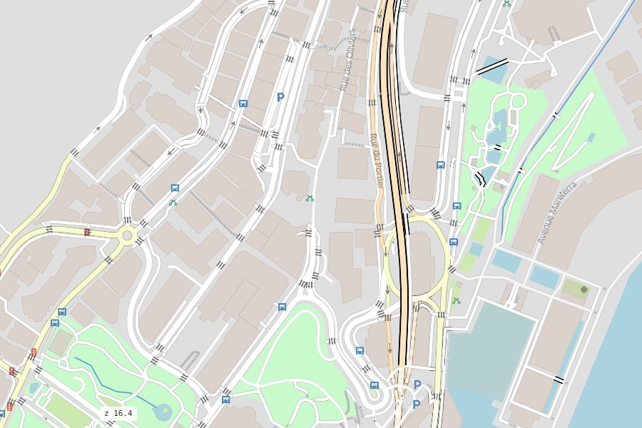
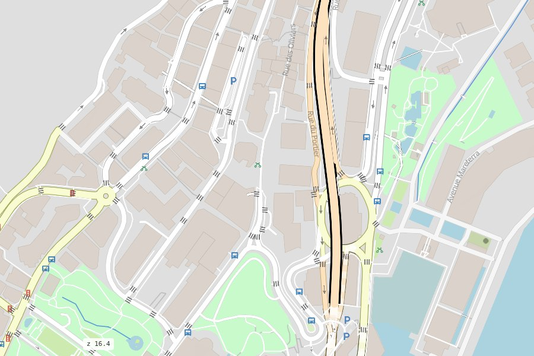
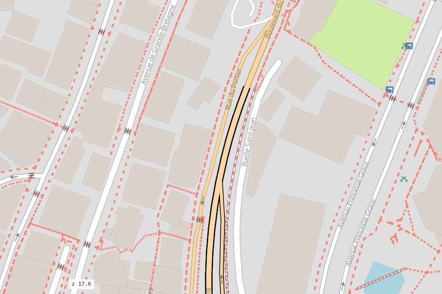
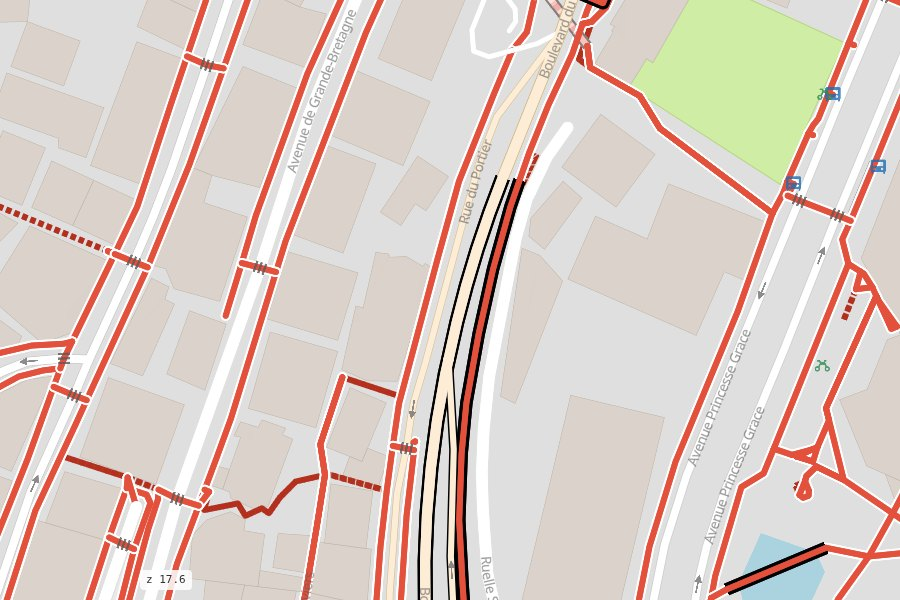
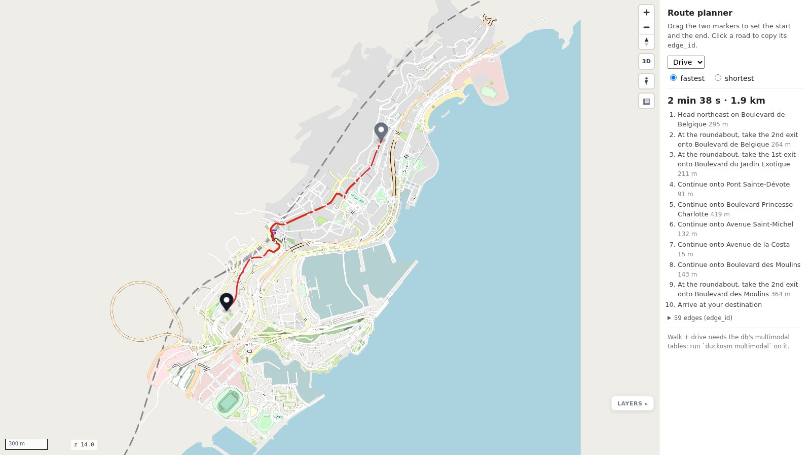

# Gallery

Monaco, built by duckOSM from OpenStreetMap and drawn by mapstyle. Every map is a live,
self-contained page (3-5 MB): pan, zoom, click.

<iframe class="ms-demo" src="../maps/all.html" title="Monaco: the whole map" loading="lazy"></iframe>

<figure markdown><figcaption>[The whole map](maps/all.html): every travel mode</figcaption></figure>
<figure markdown><figcaption>[Driving](maps/driving.html): the roads for cars in front</figcaption></figure>
<figure markdown><figcaption>[Walking](maps/walking.html): paths in front, cars faded</figcaption></figure>
<figure markdown><figcaption>[Cycling](maps/cycling.html): cycleways in front</figcaption></figure>
<figure markdown><figcaption>[Paths as on openstreetmap.org](maps/paths_osm.html)</figcaption></figure>
<figure markdown><figcaption>[Walking, Komoot-style paths](maps/paths_komoot.html)</figcaption></figure>
<figure markdown><figcaption>[Dashboard](maps/dashboard.html): filter, colour, inspect</figcaption></figure>
<figure markdown><figcaption>[Route planner](maps/planner.html): drag start and end</figcaption></figure>

Map data © [OpenStreetMap](https://www.openstreetmap.org/copyright) contributors; the sea from
[Overture Maps](https://overturemaps.org/), built from OpenStreetMap's coastline.
