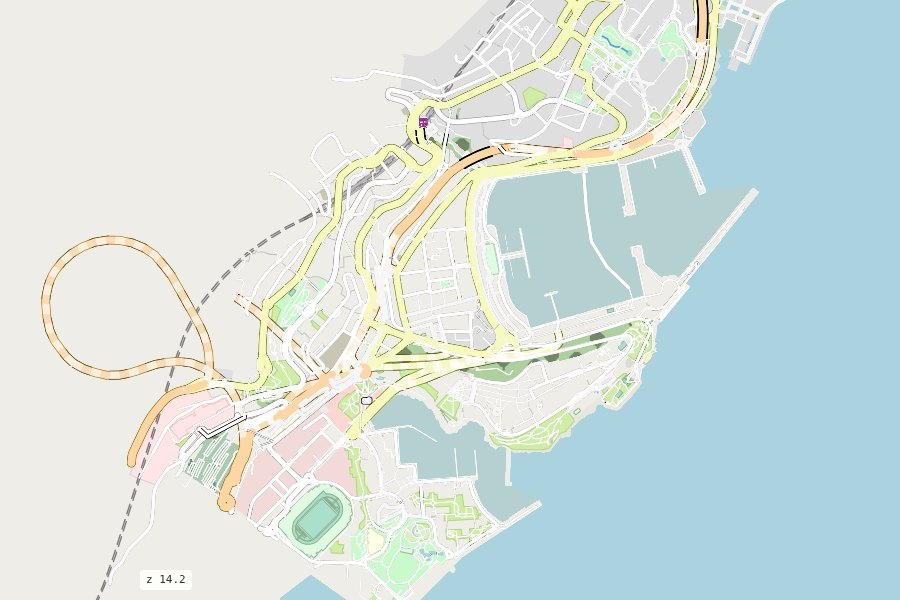
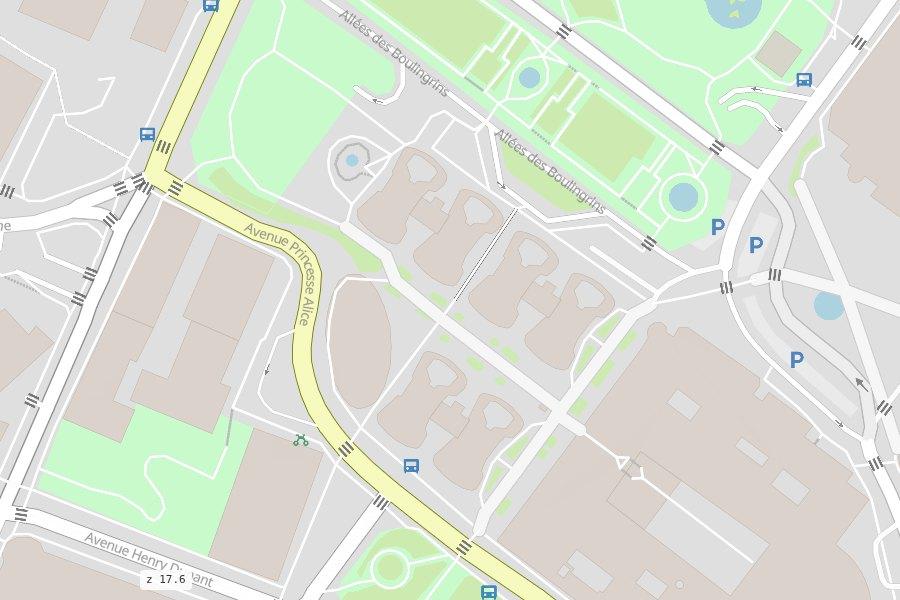

# The base map

<p class="lead">Everything that isn't a road comes from the same duckOSM database (its <code>features.*</code>
layers), styled like openstreetmap.org. No tile server, no API key.</p>

<div class="ms-shots" markdown>
<figure markdown><figcaption>The coast at zoom 14: sea, port, parks, built-up areas</figcaption></figure>
<figure markdown><figcaption>Monte-Carlo at zoom 17.6: buildings, gardens, parking, bus stops, crossings</figcaption></figure>
</div>

## The layers

In drawing order, bottom first. Each has a row in the **LAYERS** box, so it can be hidden.

| Layer | From duckOSM | Shows | From zoom |
|---|---|---|---|
| `ocean` | `features.ocean` | the sea | |
| `landcover` | `features.land` (+ school, hospital and sports grounds from `sites`) | parks, grass, forest, residential and industrial land, cemeteries, beaches…; forests, orchards, cemeteries, wetland and scrub get openstreetmap.org's textures | |
| `water` | `features.water_polygons` | lakes, rivers, basins, docks | |
| `waterways` | `features.water_lines` | rivers, streams, canals, ditches | |
| `buildings` | `features.buildings` | building footprints | 15 |
| `railways` | `features.streets` | rail, tram, light rail, subway, funicular, monorail | |
| `parking` | `features.sites` | car parks | 15 |
| `parking_p` | `features.sites` | a "P" on each car park | 16 |
| `bus_station` | `features.sites` | bus station footprints | 15 |
| `platform` | `features.sites` | transit platforms | |
| `traffic_signals` | `features.traffic` | traffic lights | 16 |
| `crossings` | `features.traffic` | pedestrian crossings, turned to lie across their road | 16 |
| `bus_stations` | `features.public_transport` | bus stops | 16 |
| `train_stations` | `features.public_transport` | railway stations and halts | 12 |
| `bicycle` | `features.pois` | bicycle rental | 16 |

The roads are drawn between the area layers and the points: the points (icons) are always on top.

## The sea

OpenStreetMap has no sea polygons, only coastlines. duckOSM fills `features.ocean` from Overture
Maps' ocean polygons (built from OpenStreetMap's coastline) while it builds the database. A database
built offline, or with `options.sea: false`, has no sea: the coast's water is then land-coloured.

## Choose the layers

```python
ms.render_map(db, layers=["buildings", "crossings"])   # just these
ms.render_map(db, layers=False)                        # roads only
```

```bash
mapstyle monaco.duckdb --no-layers
```

A database built without the base map (`duckosm build --no-features`) gives the roads only, with a
logged hint.

## Clicks, tooltips and kinds

Each layer can be clickable (a popup with its name and kind), show a hover tooltip, or neither:

```python
ms.render_map(db, interaction={"crossings": {"tooltip": True}, "landcover": {"clickable": True}})
```

From JavaScript, `rsSetInteraction`, `rsSetKinds` (only some kinds of a layer, e.g. just parks) and
roadstyle's `rsSetOverlay` change them on the page ([JavaScript API](../reference/javascript.md)).

## Change the look

The base map is data: `styles/layers.yaml` says which layers, in which order, with which filter;
`styles/osm_carto.yaml` says how each looks (colours by kind, outlines, textures, icons, zoom
ranges). See [Styles](../reference/styles.md).

The raster maps of roadstyle (CARTO Voyager and Positron, OpenStreetMap, satellite) stay in the
base-map switcher (top right) for comparison; they are loaded from the web.
