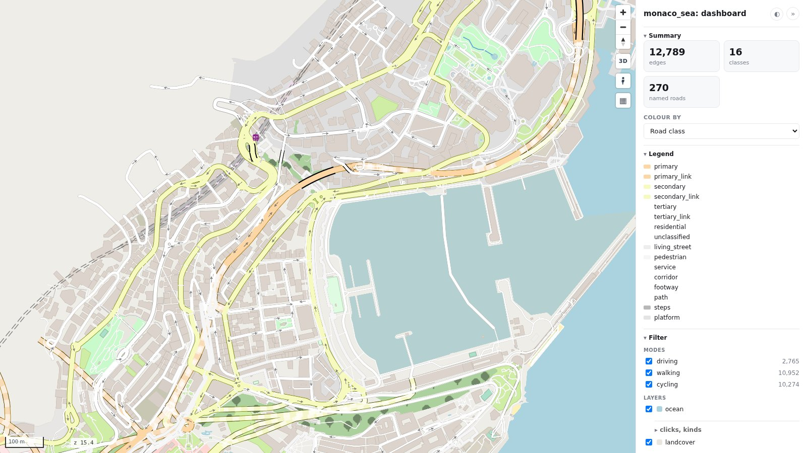

# Dashboard

<p class="lead">One page to explore a database: every road and layer, a side panel to filter, colour and
inspect.</p>



[:material-view-dashboard-outline: Try it](../maps/dashboard.html){ .md-button .md-button--primary }

```bash
mapstyle monaco.duckdb --dashboard
```

```python
ms.render_map("monaco.duckdb", dashboard=True)
```

## The side panel

- **Summary:** how many roads, classes and features are on the map.
- **Colour by** road class, or by **mode**: which modes can use each road (all modes, driving +
  walking, walking only, …), with a legend.
- **Filter** by mode (Driving, Walking, Cycling, with a count each), private roads and bus lanes,
  by road class, and by layer.
- Per layer, **clicks, kinds**: make it clickable or not, turn its hover tooltip and click popup on
  or off, and show only some of its kinds (just parks, say).
- **Search**, and the fields of whatever you clicked: a road, or a feature and the roads under it.

The panel is roadstyle's report page (`roadstyle.render_report`); mapstyle adds the mode filter, the
mode colouring and the per-layer switches. Each is a [JavaScript call](../reference/javascript.md)
too, so your own page can drive the same filters.
