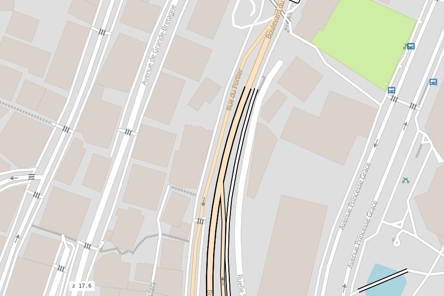
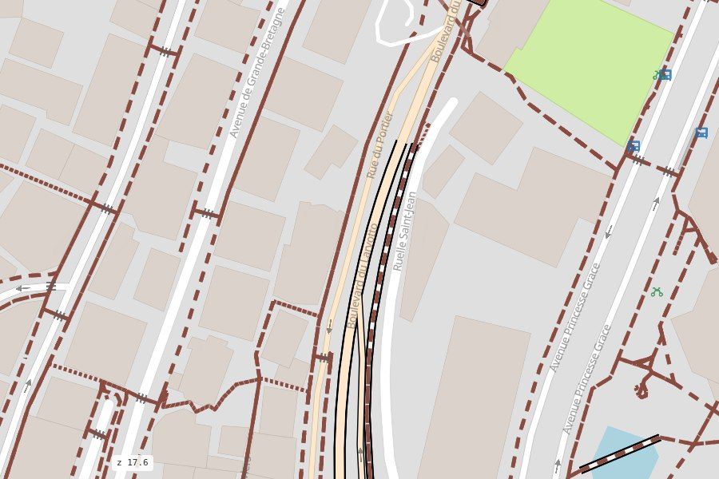

# Travel modes & path styles

<p class="lead">A mode picks which network stands out; a path style picks how footways and cycleways look.
The two are independent.</p>

## Travel modes

Every page has every road. The mode decides what comes to the front:

| Mode | What stands out | Live |
|---|---|---|
| `all` (default) | nothing: every network at its own width, as on a general map | [open](../maps/all.html) |
| `driving` | the roads for cars | [open](../maps/driving.html) |
| `walking` | footways, paths, steps, pedestrian streets; the roads for cars thinner and faded | [open](../maps/walking.html) |
| `cycling` | cycleways; the roads for cars faded | [open](../maps/cycling.html) |

<div class="ms-shots" markdown>
<figure markdown><figcaption>all</figcaption></figure>
<figure markdown><figcaption>driving</figcaption></figure>
<figure markdown><figcaption>walking</figcaption></figure>
<figure markdown><figcaption>cycling</figcaption></figure>
</div>

```bash
mapstyle monaco.duckdb --mode walking
```

```python
ms.render_map("monaco.duckdb", mode="walking")
```

In the `walking` and `cycling` modes every road is one centred line (no lanes), so the paths beside
it stay readable. On any page, `rsSetModes(["walking"])` shows only the roads a mode can use
([JavaScript API](../reference/javascript.md)).

## Path styles

How walking and cycling paths look, on top of the mode:

| Style | Looks like |
|---|---|
| `google` (default) | Google / Apple Maps: calm, thin, light solid lines |
| `osm` | openstreetmap.org: thin dotted and dashed paths ([live](../maps/paths_osm.html)) |
| `komoot` | outdoor apps: bold solid colours with a white halo, by type ([live](../maps/paths_komoot.html)) |
| `cyclosm` | the CyclOSM map: solid blue cycleways, thin dark dashed footways |

<div class="ms-shots" markdown>
<figure markdown><figcaption>google</figcaption></figure>
<figure markdown><figcaption>osm</figcaption></figure>
<figure markdown><figcaption>komoot</figcaption></figure>
<figure markdown><figcaption>cyclosm</figcaption></figure>
</div>

```bash
mapstyle monaco.duckdb --mode walking --paths komoot
```

Both are data: `styles/modes.yaml` and `styles/paths.yaml` ([Styles](../reference/styles.md)).
