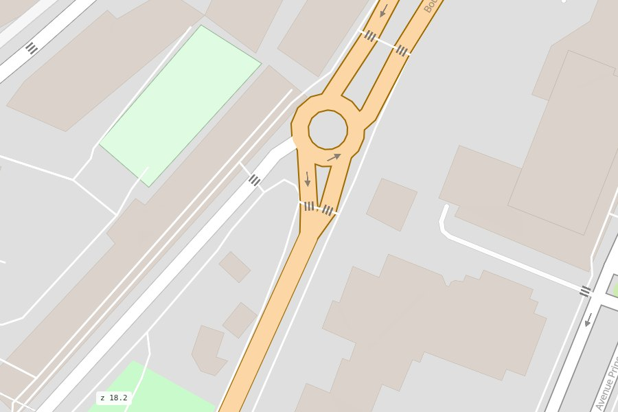
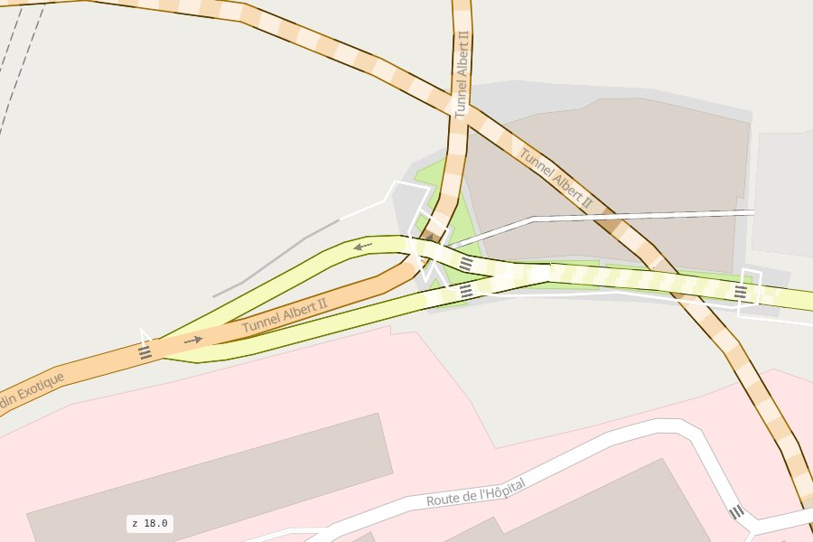
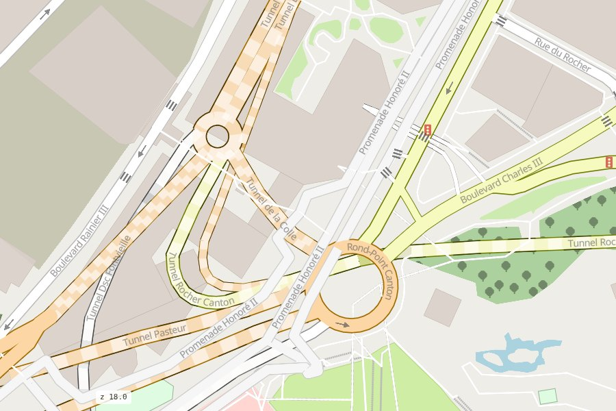

# How roads are drawn

A road network is not a set of independent lines: roads join, cross over and under each
other, and run in two directions. mapstyle draws each edge of the duckOSM network so that junctions
read right.

Every road edge stays its own feature on the page: hover it, click it, filter it or colour it by its
`edge_id`, whatever the drawing does around it.

## Two directions, two lanes

duckOSM stores a two-way street as two directed edges. They are drawn side by side, one per
direction (from zoom 15), so each can be clicked and coloured on its own, and their shared end is
drawn as one round end, not two bumps.

A one-way street is one line with arrows. duckOSM also gives it a walking-only reverse edge
(pedestrians may walk both ways); mapstyle marks that edge `is_directed = false`, so it doesn't turn
the street into a two-way road. Footways, steps and other paths are one line too, whichever way you
walk them.

<figure markdown><figcaption>Two-way roads as two lanes; crossings drawn over their street</figcaption></figure>

## Over and under

The OpenStreetMap `layer`, `bridge` and `tunnel` tags decide what passes over what:

- **Bridges** are drawn over the roads they cross, with square deck ends.
- **Tunnels** are ordinary roads with a tunnel style: a dashed outline and light dashes on a faded
  fill. A tunnel goes under the roads only where it really passes under one (within 4 m, along the
  whole of a shallow crossing); its mouths join their street like any road continuing, with no
  dead-end cap.
- **A road with only a `layer` tag** acts the same: one that passes over or under nothing is drawn
  with the ground roads, so a tunnel approach tagged `layer=-1` still joins the road it meets. A
  raised walkway is drawn over a street only where it crosses it, clear of the street's drawn width.
- **Crossings** (`footway=crossing`) are drawn over their street, **mapped sidewalks** under it.
- **Slip roads** (`*_link`) are drawn under the streets they join.

<figure markdown><figcaption>Tunnel Albert II: the road runs into the tunnel; the tunnel is dashed</figcaption></figure>
<figure markdown><figcaption>Promenade Honoré II (a raised walkway) over Rond-Point Canton</figcaption></figure>

The **Bridges** and **Tunnels** rows in the **ROADS** box hide them.

## Roads you may not use

duckOSM keeps the roads a mode may not use apart (`private_edges`): private roads (driveways, gated
streets) and, for cars, bus-only roads and bus lanes. They are on the map in their own colour,
**grey** for private and **muted blue** for bus, each with a row in the **ROADS** box
(**Private roads**, **Bus lanes**) to hide or show them. They are never part of a route.

Which roads count depends on the map's mode: on a driving map, those cars may not use (as duckOSM's
driving map); on the map of every mode, bus lanes (even where bikes may use them) and the private
roads no mode can use. Your own colours (`rsColor`) paint over them.

## Where it comes from

This drawing is [roadstyle](https://khoshkhah.github.io/roadstyle/)'s (0.10 and later), fed by
mapstyle with what it knows from duckOSM: which edges are directed (`directed_col`), and which paths
are crossings or sidewalks (`band_col`, from duckOSM's `walk_type`).
