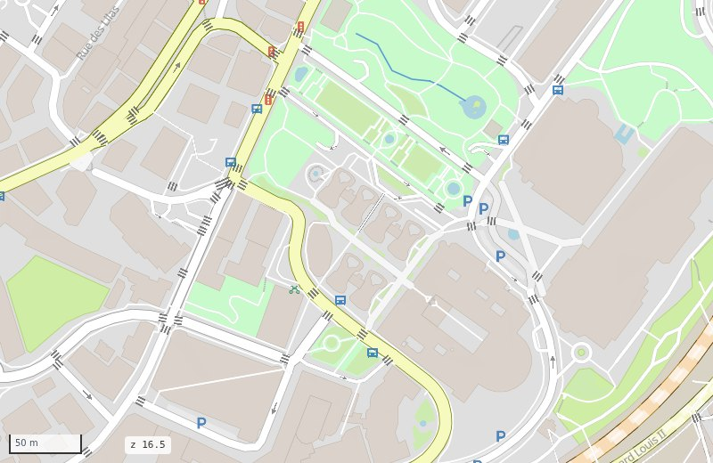
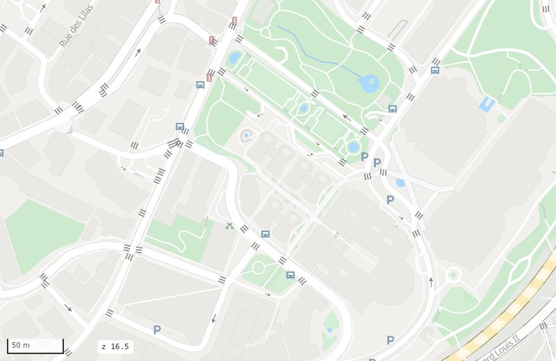
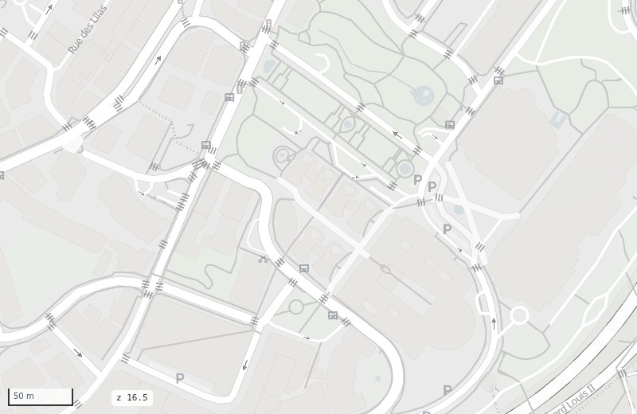
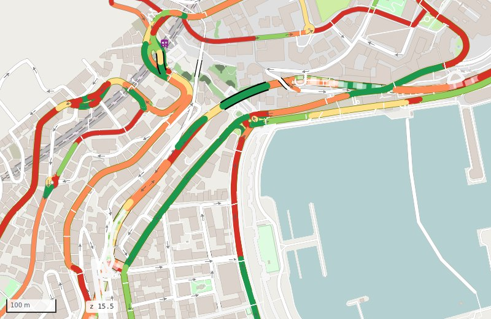
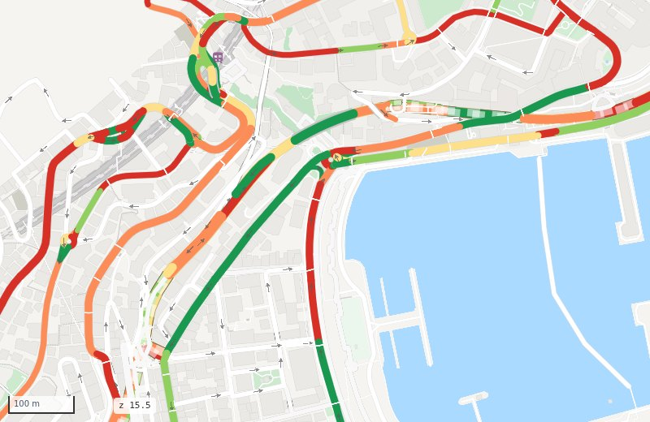
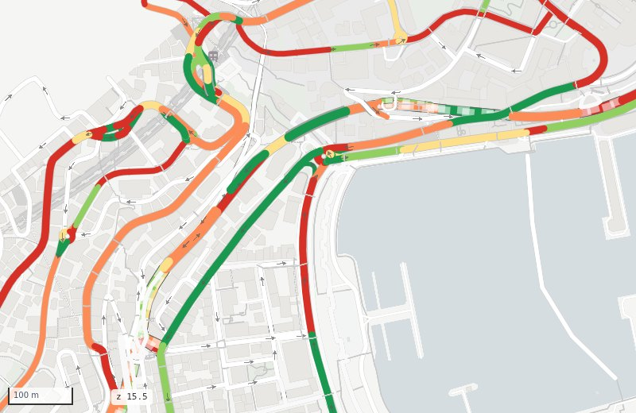

# Themes

<p class="lead">A theme gives the whole map its colours: the roads, the base map and the background.
It combines with any travel mode and path style.</p>

| Theme | Feel | For |
|---|---|---|
| `osm` (default) | detailed and colourful, as openstreetmap.org | exploring an area, checking the data |
| `google` | clean and friendly: light land, white streets, yellow main roads, light blue water, soft green parks | maps for everyone |
| `grey` | quiet greys, a hint of blue water and green parks | your own data on top: flows, routes, sensors |

<div class="ms-shots" markdown>
<figure markdown><figcaption>osm</figcaption></figure>
<figure markdown><figcaption>google</figcaption></figure>
<figure markdown><figcaption>grey</figcaption></figure>
</div>

```bash
mapstyle monaco.duckdb --theme google
mapstyle monaco.duckdb --theme grey --dashboard
```

```python
ms.render_map("monaco.duckdb", theme="google")
ms.render_map("monaco.duckdb", mode="walking", theme="grey")
```

Live: [google](../maps/theme_google.html) · [grey](../maps/theme_grey.html).

## Your data on top

A theme never changes your own colours: `rsColor`, colour options, the dashboard's colouring by
mode, the route planner's route. On `grey` they stand out most:

<div class="ms-shots" markdown>
<figure markdown><figcaption>osm</figcaption></figure>
<figure markdown><figcaption>google</figcaption></figure>
<figure markdown><figcaption>grey</figcaption></figure>
</div>

## Make your own

A theme is one short YAML file in `src/mapstyle/styles/themes/`. It never has to list every colour:
a **transform** recolours everything of the `osm` look, then you set the colours that matter.

```yaml
# styles/themes/mine.yaml
background: "#f5f5f3"            # the land
transform:                        # every osm colour not set below:
  saturation: 0.3                 #   keep 30 % of its colour
  lighten: 0.25                   #   then 25 % of the way to white
roads:
  colors:
    primary: {fill: "#fde9a6", casing: "#ead08a"}   # same keys as styles/osm_carto.yaml
features:
  areas:
    water: {fill: "#aadaff"}
  landcover_pattern: {}           # {} empties a section: here, no textures
paths:
  footway: {fill: "#c9c9c9"}      # path colours over any path style
roadstyle:
  bridge_casing_color: "#c4c4c4"  # roadstyle settings
```

Then `--theme mine`. See [Styles](../reference/styles.md) for every key.
