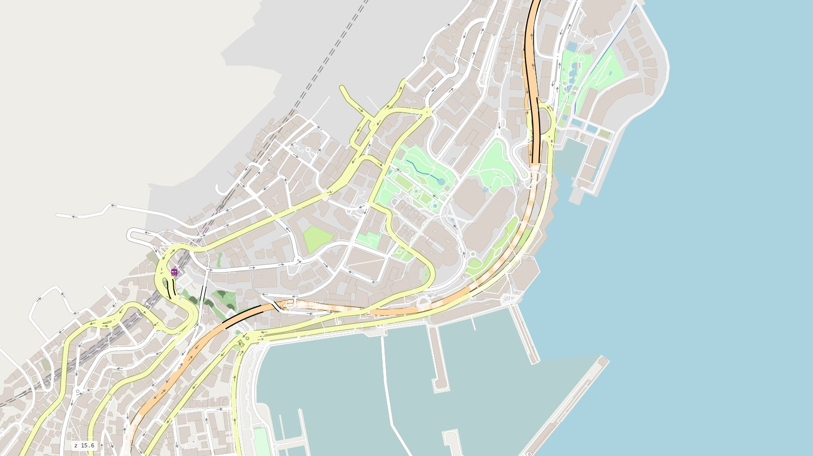

# mapstyle

<p class="lead">A whole OpenStreetMap map in one offline HTML page: the roads for driving, walking and
cycling over a full base map, from one <a href="https://github.com/Khoshkhah/duckOSM">duckOSM</a> database.</p>

<div class="ms-hero" markdown>

</div>

[:material-map: Open the live map](maps/all.html){ .md-button .md-button--primary }
[:material-rocket-launch: Get started](get-started.md){ .md-button }

```bash
pip install "duckosm @ git+https://github.com/Khoshkhah/duckOSM" \
            "mapstyle @ git+https://github.com/Khoshkhah/mapstyle"

curl -LO https://download.geofabrik.de/europe/monaco-latest.osm.pbf
duckosm build --pbf monaco-latest.osm.pbf -o monaco.duckdb \
              -m driving -m walking -m cycling
mapstyle monaco.duckdb          # -> monaco_all.html: one file, opens offline
```

## What you get

<div class="grid cards" markdown>

-   :material-car-side:{ .lg .middle } **Every travel mode**

    ---

    One map for driving, walking and cycling, or one network brought to the front: the roads
    for cars fade, the paths stand out.

    [:octicons-arrow-right-24: Travel modes & path styles](guides/modes.md)

-   :material-layers-triple:{ .lg .middle } **A full base map**

    ---

    The sea, land use, water, buildings, railways, parking, transit and road furniture, all from
    the same database. No tile server, no API key.

    [:octicons-arrow-right-24: The base map](guides/base-map.md)

-   :material-bridge:{ .lg .middle } **Roads drawn right**

    ---

    Bridges over, tunnels under only where they really pass under a road, raised walkways,
    crossings over their street, two-way roads as two lanes.

    [:octicons-arrow-right-24: How roads are drawn](guides/roads.md)

-   :material-map-marker-path:{ .lg .middle } **Route planner**

    ---

    Drag a start and an end: fastest or shortest route, turn-by-turn directions, by car, on foot,
    by bike, or walk + drive.

    [:octicons-arrow-right-24: Route planner](guides/planner.md)

-   :material-view-dashboard-outline:{ .lg .middle } **Dashboard**

    ---

    Filter by mode, road class and layer, colour by mode, and read every road and feature you
    click in a side panel.

    [:octicons-arrow-right-24: Dashboard](guides/dashboard.md)

-   :material-language-javascript:{ .lg .middle } **A JavaScript API**

    ---

    Every page is a [roadstyle](https://khoshkhah.github.io/roadstyle/) page: filter, colour and
    query roads and layers from your own code, with 3D and vector tiles built in.

    [:octicons-arrow-right-24: JavaScript API](reference/javascript.md)

</div>

## How it fits together

| Project | Its part |
|---|---|
| [**duckOSM**](https://github.com/Khoshkhah/duckOSM) | turns an OpenStreetMap extract into one DuckDB file: the driving, walking and cycling networks, plus the base-map layers (`features.*`, the sea included) |
| **mapstyle** | reads that file (with `duckdb`, nothing else) and styles all of it as one map |
| [**roadstyle**](https://khoshkhah.github.io/roadstyle/) | draws the page: [MapLibre GL](https://maplibre.org/), the road styling, and the JavaScript API |

The result is a single HTML file you can open from disk, email, or put on any web server.
